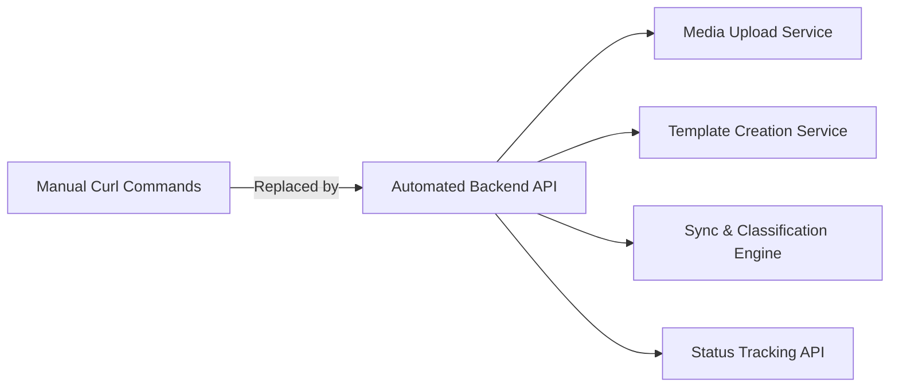
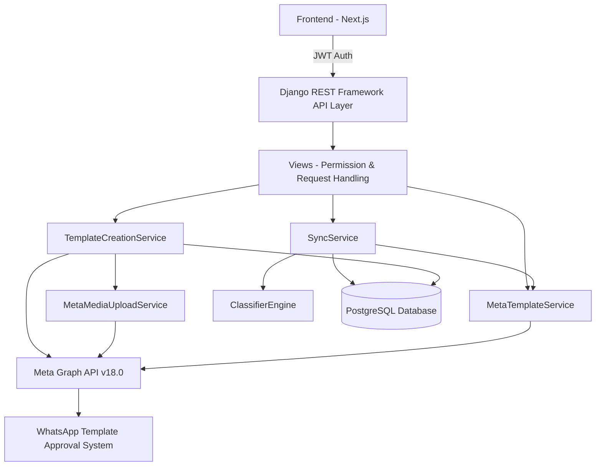
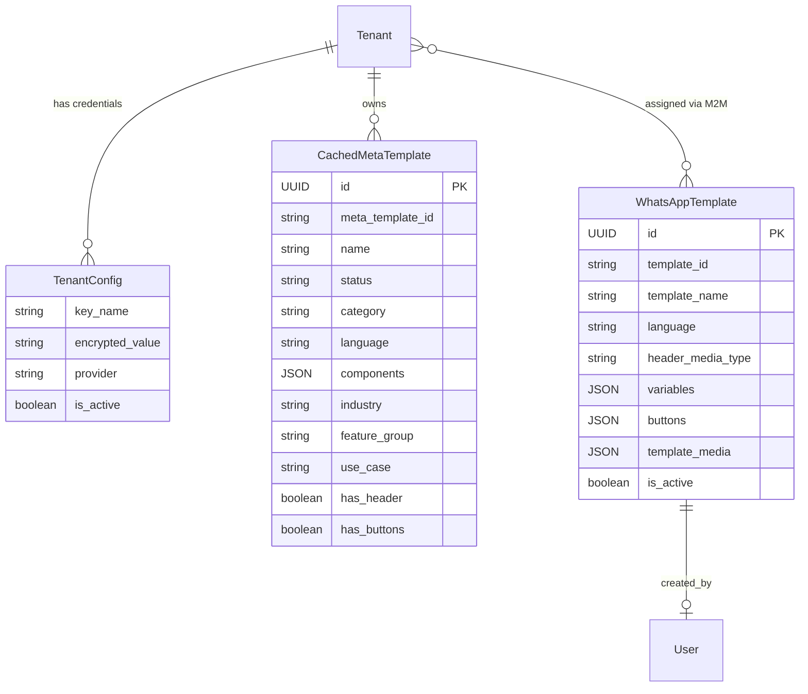
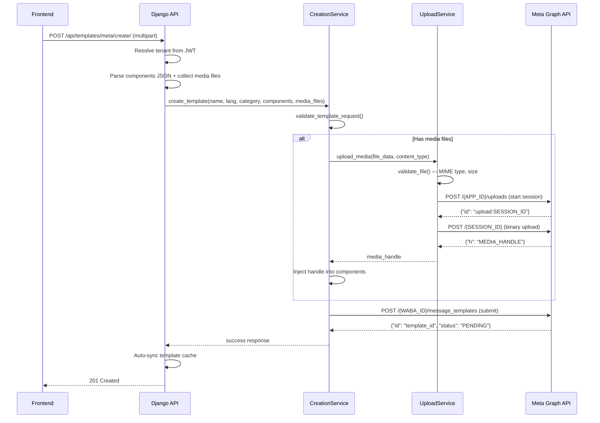
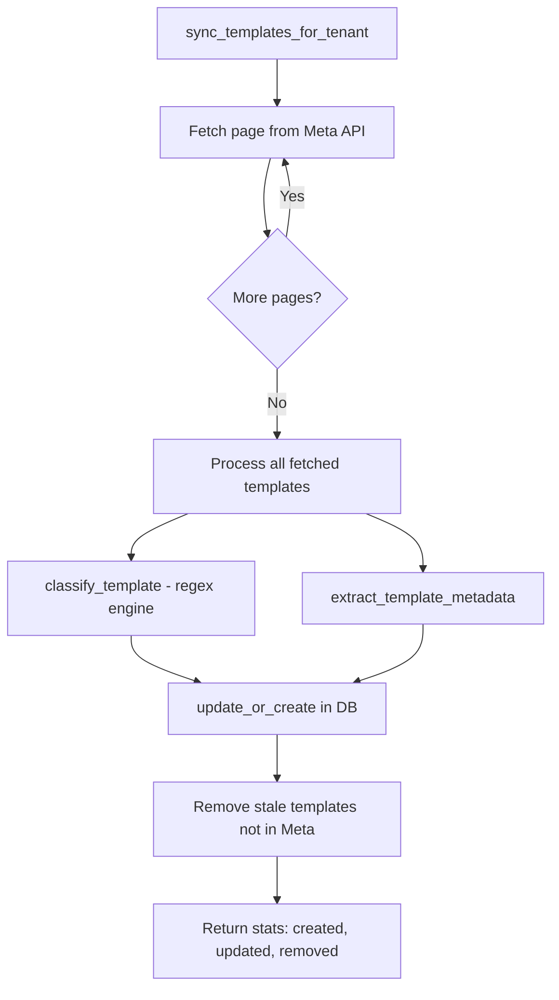
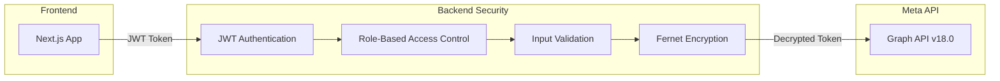

# WhatsApp Template Creation & Approval Automation System

Company: Curlshell Pvt. Ltd.  
Intern: Om Ghante  
Role: Software Developer Intern  
Duration: Dec 2025 - Present

# 1. Project Overview

During my internship at Curlshell, I developed a fully automated backend system to:

- Upload media to Meta (WhatsApp Business Platform) via the Resumable Upload API
- Generate media handles programmatically
- Create WhatsApp message templates (including Carousel templates)
- Submit templates for Meta approval
- Track approval status in real-time
- Sync and cache all WABA templates locally with automatic classification
- Delete templates from Meta
- Fetch WhatsApp Business Profile
- Handle errors, validations, and multi-tenant credential management securely

This system replaces the manual curl-based workflow with a production-grade, multi-tenant backend API built on **Django + Django REST Framework**.

# 2. Problem Statement

Previously, creating WhatsApp templates required manual steps:

1. Checking image size via terminal (`stat -c%s image.jpg`)
2. Starting upload session via curl
3. Uploading binary media via curl
4. Copying media handle manually from response
5. Injecting handle into JSON template payload
6. Submitting template via curl
7. Tracking approval status manually by re-querying the API

This process was:
- Manual and tedious
- Error-prone (copy-paste mistakes with media handles)
- Not scalable for multiple tenants/clients
- Not suitable for production SaaS systems
- Insecure (tokens exposed in terminal history)

The goal was to **fully automate this entire workflow** inside our multi-tenant backend with proper service-layer architecture.



# 3. Technology Stack

| Layer | Technology |
|---|---|
| **Backend Framework** | Python 3.x, Django 5.0+, Django REST Framework 3.15+ |
| **HTTP Client** | `requests` library (for all Meta Graph API calls) |
| **File Handling** | DRF `MultiPartParser`, `FormParser`, Django `FileField`/`ImageField` |
| **Database** | PostgreSQL (via `psycopg2-binary` + `dj-database-url`), SQLite for dev |
| **Authentication** | JWT via `djangorestframework-simplejwt` |
| **Encryption** | `cryptography` (Fernet symmetric encryption for API secrets) |
| **Environment Config** | `python-dotenv` |
| **Task Queue** | Celery + Redis + `django-celery-beat` |
| **Image Processing** | Pillow |
| **API** | Meta Graph API v18.0 (WhatsApp Business Platform) |
| **Deployment** | Docker, Gunicorn, WhiteNoise for static files |

# 4. System Architecture



### Django App Structure

```
templates/
├── __init__.py
├── models.py              # WhatsAppTemplate, CachedMetaTemplate
├── views.py               # All API view classes
├── serializers.py          # DRF serializers
├── upload_service.py       # MetaMediaUploadService (Resumable Upload)
├── creation_service.py     # TemplateCreationService (orchestrator)
├── meta_service.py         # MetaTemplateService (fetch templates from WABA)
├── sync_service.py         # Template sync, caching & stale removal
├── classifier.py           # Regex-based classification engine
├── admin.py                # Django admin config
└── migrations/
```

### Key Architecture Decisions

- **Multi-Tenant Design**: Each tenant (client) has their own WABA credentials stored encrypted in `TenantConfig`
- **Service Layer Pattern**: All business logic separated into dedicated service classes — views only handle HTTP
- **Credential Isolation**: Access tokens encrypted with Fernet and loaded per-tenant at runtime — **never exposed to frontend**
- **Role-Based Access**: `SUPER_ADMIN`, `TENANT_ADMIN`, `TENANT_USER`, `AGENCY_ADMIN` with granular DRF permission classes

# 5. Multi-Tenant Credential Management

All Meta API credentials are stored per-tenant in the `TenantConfig` model with **Fernet encryption**.

### Credentials Stored Per Tenant

| Key Name | Purpose |
|---|---|
| `access_token` | System User permanent token for Graph API |
| `business_account_id` | WhatsApp Business Account (WABA) ID |
| `app_id` | Meta Developer App ID (for Resumable Upload API) |
| `phone_number_id` | Phone number ID (for business profile) |

### How Credentials Are Loaded (from `upload_service.py`)

```python
def _load_credentials(self):
    """Load encrypted Meta API credentials for tenant."""
    try:
        token_config = TenantConfig.objects.filter(
            tenant=self.tenant,
            provider=ConfigProvider.META_WHATSAPP,
            key_name='access_token',
            is_active=True
        ).first()

        app_config = TenantConfig.objects.filter(
            tenant=self.tenant,
            provider=ConfigProvider.META_WHATSAPP,
            key_name='app_id',
            is_active=True
        ).first()

        if token_config:
            self.access_token = token_config.get_value()  # Fernet-decrypted
        if app_config:
            self.app_id = app_config.get_value()  # Fernet-decrypted

    except Exception as e:
        logger.error(f"Failed to load Meta credentials for {self.tenant.name}: {e}")
```

The `get_value()` method automatically decrypts the stored value using the `FERNET_KEY` from environment variables.

# 6. Database Models

## 6.1 WhatsAppTemplate Model

Internal template model for campaign management. SuperAdmin creates and assigns templates to tenants.

```python
class WhatsAppTemplate(models.Model):
    id = models.UUIDField(primary_key=True, default=uuid.uuid4, editable=False)
    template_id = models.CharField(max_length=100, help_text='Meta WhatsApp template ID')
    language = models.CharField(max_length=10, default='en_US')
    template_name = models.CharField(max_length=255, help_text='Unique template name')

    # Header media support
    header_media_type = models.CharField(
        max_length=10, choices=HeaderMediaType.choices, default=HeaderMediaType.NONE,
        help_text='Type of header media: none, image, video, or both'
    )
    header_media_image = models.ImageField(upload_to='templates/headers/images/', blank=True, null=True)
    header_media_video = models.FileField(upload_to='templates/headers/videos/', blank=True, null=True)

    # Variables & Buttons
    has_variables = models.BooleanField(default=False)
    variables = models.JSONField(default=list, blank=True,
        help_text='List of variables: [{"name": "username", "type": "text"}, ...]')
    has_buttons = models.BooleanField(default=False)
    buttons = models.JSONField(default=list, blank=True,
        help_text='List of buttons: [{"text": "Visit", "type": "URL", "value": "https://..."}]')

    # Universal template metadata (for Meta-approved template setup)
    template_type = models.CharField(max_length=20, choices=[
        ('marketing', 'Marketing'), ('utility', 'Utility'), ('authentication', 'Authentication'),
    ], default='marketing')
    template_media = models.JSONField(default=dict, blank=True,
        help_text='Media config: {"enabled": bool, "allowed_types": ["image","video"], "multiple": bool}')
    variables_config = models.JSONField(default=dict, blank=True)
    buttons_config = models.JSONField(default=dict, blank=True)
    preview_assets = models.JSONField(default=dict, blank=True)

    # Multi-tenant assignment (Many-to-Many)
    assigned_clients = models.ManyToManyField('tenants.Tenant', related_name='whatsapp_templates', blank=True)
    created_by = models.ForeignKey(settings.AUTH_USER_MODEL, on_delete=models.SET_NULL, null=True, blank=True)
    is_active = models.BooleanField(default=True, help_text='Soft delete flag')
    created_at = models.DateTimeField(auto_now_add=True)
    updated_at = models.DateTimeField(auto_now=True)

    class Meta:
        db_table = 'whatsapp_templates'
        ordering = ['-created_at']
        indexes = [
            models.Index(fields=['created_at'], name='whatsapp_te_created_ca7962_idx'),
            models.Index(fields=['is_active', 'created_at'], name='whatsapp_te_is_acti_af2aeb_idx'),
        ]
```

## 6.2 CachedMetaTemplate Model

Cached copy of templates fetched from Meta Graph API with **internal classification** that Meta does NOT provide.

```python
class CachedMetaTemplate(models.Model):
    id = models.UUIDField(primary_key=True, default=uuid.uuid4, editable=False)
    tenant = models.ForeignKey('tenants.Tenant', on_delete=models.CASCADE,
        related_name='cached_meta_templates')

    # From Meta Graph API
    meta_template_id = models.CharField(max_length=100)
    name = models.CharField(max_length=512)
    status = models.CharField(max_length=20, choices=TemplateStatus.choices, default=TemplateStatus.PENDING)
    category = models.CharField(max_length=20, choices=TemplateCategory.choices, default=TemplateCategory.UTILITY)
    language = models.CharField(max_length=20, default='en_US')
    components = models.JSONField(default=list, blank=True)  # Full components JSON from Meta
    quality_score = models.CharField(max_length=50, blank=True, default='')
    rejected_reason = models.TextField(blank=True, default='')

    # Internal classification (derived by our classifier, not from Meta)
    industry = models.CharField(max_length=100, blank=True, default='')       # E-commerce, Healthcare, etc.
    feature_group = models.CharField(max_length=100, blank=True, default='')  # Order Management, Payments, etc.
    use_case = models.CharField(max_length=200, blank=True, default='')       # Order confirmation, etc.

    # Extracted metadata for fast filtering
    has_header = models.BooleanField(default=False)
    header_format = models.CharField(max_length=20, blank=True, default='')
    has_buttons = models.BooleanField(default=False)
    button_count = models.IntegerField(default=0)
    body_text = models.TextField(blank=True, default='', help_text='Extracted body text for search')

    last_synced_at = models.DateTimeField(auto_now=True)
    created_at = models.DateTimeField(auto_now_add=True)

    class Meta:
        db_table = 'cached_meta_templates'
        unique_together = [('tenant', 'meta_template_id', 'language')]
        indexes = [
            models.Index(fields=['tenant', 'status'], name='cached_mt_tenant_status_idx'),
            models.Index(fields=['tenant', 'category'], name='cached_mt_tenant_cat_idx'),
            models.Index(fields=['tenant', 'industry'], name='cached_mt_tenant_ind_idx'),
            models.Index(fields=['tenant', 'feature_group'], name='cached_mt_tenant_feat_idx'),
            models.Index(fields=['name'], name='cached_mt_name_idx'),
        ]
```



# 7. Complete Workflow Implementation



## Step 1: Media File Validation (`upload_service.py`)

When a user uploads media for a template, the `MetaMediaUploadService` validates it programmatically — replacing the manual `stat -c%s image.jpg` command.

### Allowed File Types & Size Limits

```python
GRAPH_API_VERSION = getattr(settings, 'META_GRAPH_API_VERSION', 'v18.0')
GRAPH_API_URL = f'https://graph.facebook.com/{GRAPH_API_VERSION}'

MAX_FILE_SIZES = {
    'image/jpeg': 5 * 1024 * 1024,       # 5 MB
    'image/png': 5 * 1024 * 1024,         # 5 MB
    'image/webp': 5 * 1024 * 1024,        # 5 MB
    'video/mp4': 16 * 1024 * 1024,        # 16 MB
    'video/3gpp': 16 * 1024 * 1024,       # 16 MB
}

ALLOWED_IMAGE_TYPES = {'image/jpeg', 'image/png', 'image/webp'}
ALLOWED_VIDEO_TYPES = {'video/mp4', 'video/3gpp'}
ALLOWED_TYPES = ALLOWED_IMAGE_TYPES | ALLOWED_VIDEO_TYPES
```

### Validation Logic

```python
@staticmethod
def validate_file(file_data: bytes, content_type: str, filename: str = '') -> Tuple[bool, str]:
    content_type = content_type.lower().strip()

    if content_type not in ALLOWED_TYPES:
        return False, f"Unsupported file type: {content_type}. Allowed: {', '.join(sorted(ALLOWED_TYPES))}"

    file_size = len(file_data)
    max_size = MAX_FILE_SIZES.get(content_type, 5 * 1024 * 1024)
    if file_size > max_size:
        max_mb = max_size / (1024 * 1024)
        actual_mb = file_size / (1024 * 1024)
        return False, f"File too large: {actual_mb:.1f}MB. Maximum for {content_type}: {max_mb:.0f}MB"

    if file_size == 0:
        return False, "File is empty"

    return True, ""
```

### MIME Type Detection Fallback

```python
@staticmethod
def detect_content_type(filename: str, provided_type: str = '') -> str:
    if provided_type and provided_type in ALLOWED_TYPES:
        return provided_type

    guessed, _ = mimetypes.guess_type(filename)
    if guessed and guessed in ALLOWED_TYPES:
        return guessed

    ext = os.path.splitext(filename)[1].lower()
    ext_map = {
        '.jpg': 'image/jpeg', '.jpeg': 'image/jpeg', '.png': 'image/png',
        '.webp': 'image/webp', '.mp4': 'video/mp4', '.3gp': 'video/3gpp',
    }
    return ext_map.get(ext, provided_type or 'application/octet-stream')
```

## Step 2: Start Upload Session (Resumable Upload API)

```python
def start_upload_session(self, file_length: int, file_type: str) -> Dict[str, Any]:
    if not self.is_configured:
        return {'success': False, 'error': 'Meta upload API not configured.', 'code': 'NOT_CONFIGURED'}

    url = f'{GRAPH_API_URL}/{self.app_id}/uploads'
    params = {'file_length': file_length, 'file_type': file_type}
    headers = {'Authorization': f'Bearer {self.access_token}'}

    try:
        response = requests.post(url, params=params, headers=headers, timeout=30)

        if response.status_code == 200:
            data = response.json()
            session_id = data.get('id', '')  # e.g. "upload:ABCxyz123..."
            if not session_id:
                return {'success': False, 'error': 'No session ID returned', 'code': 'INVALID_RESPONSE'}
            logger.info(f"Upload session started: {session_id}")
            return {'success': True, 'session_id': session_id}
        else:
            error_data = self._parse_error(response)
            return {'success': False, 'error': error_data.get('message'), 'code': error_data.get('code')}

    except requests.exceptions.Timeout:
        return {'success': False, 'error': 'Request timed out', 'code': 'TIMEOUT'}
    except requests.exceptions.RequestException as e:
        return {'success': False, 'error': f'Network error: {str(e)}', 'code': 'NETWORK_ERROR'}
```

**Meta API Endpoint:** `POST https://graph.facebook.com/v18.0/{APP_ID}/uploads?file_length={bytes}&file_type={mime}`

**Response:**
```json
{ "id": "upload:ABCxyz123..." }
```

## Step 3: Upload Binary Media

```python
def upload_binary(self, session_id: str, file_data: bytes, content_type: str) -> Dict[str, Any]:
    if not self.access_token:
        return {'success': False, 'error': 'Access token not available', 'code': 'NOT_CONFIGURED'}

    url = f'{GRAPH_API_URL}/{session_id}'
    headers = {
        'Authorization': f'OAuth {self.access_token}',   # NOTE: OAuth, not Bearer
        'file_offset': '0',
        'Content-Type': 'application/octet-stream',
    }

    try:
        response = requests.post(url, data=file_data, headers=headers, timeout=120)

        if response.status_code == 200:
            data = response.json()
            media_handle = data.get('h', '')
            if not media_handle:
                return {'success': False, 'error': 'No media handle returned', 'code': 'INVALID_RESPONSE'}
            logger.info(f"File uploaded successfully. Handle: {media_handle[:20]}...")
            return {'success': True, 'media_handle': media_handle}
        else:
            error_data = self._parse_error(response)
            return {'success': False, 'error': error_data.get('message'), 'code': error_data.get('code')}

    except requests.exceptions.Timeout:
        return {'success': False, 'error': 'Request timed out during file upload', 'code': 'TIMEOUT'}
    except requests.exceptions.RequestException as e:
        return {'success': False, 'error': f'Network error: {str(e)}', 'code': 'NETWORK_ERROR'}
```

> **Important:** The binary upload uses `OAuth` (not `Bearer`) in the Authorization header, and a **120-second timeout** for large file uploads.

**Response:**
```json
{ "h": "4:aW1h..." }
```

## Step 4: Complete Upload Orchestration

The `upload_media()` method chains all three steps into a single call:

```python
def upload_media(self, file_data: bytes, content_type: str, filename: str = 'upload') -> Dict[str, Any]:
    # Step 1: Validate
    is_valid, error_msg = self.validate_file(file_data, content_type, filename)
    if not is_valid:
        return {'success': False, 'error': error_msg, 'code': 'VALIDATION_FAILED'}

    # Step 2: Start upload session
    session_result = self.start_upload_session(file_length=len(file_data), file_type=content_type)
    if not session_result.get('success'):
        return session_result

    session_id = session_result['session_id']

    # Step 3: Upload binary
    upload_result = self.upload_binary(session_id=session_id, file_data=file_data, content_type=content_type)
    return upload_result
```

# 8. Template Creation Service (`creation_service.py`)

The `TemplateCreationService` is the **main orchestrator** that handles the complete template creation lifecycle.

## 8.1 Validation Rules

```python
class TemplateCreationService:
    VALID_CATEGORIES = {'UTILITY', 'MARKETING', 'AUTHENTICATION'}
    VALID_LANGUAGES = {
        'en_US', 'en', 'en_GB', 'hi', 'es', 'pt_BR', 'ar', 'fr', 'de',
        'it', 'ja', 'ko', 'zh_CN', 'zh_TW', 'ru', 'tr', 'nl', 'id',
        'mr', 'bn', 'ta', 'te', 'gu', 'kn', 'ml', 'pa', 'ur',
    }
    NAME_PATTERN = re.compile(r'^[a-z][a-z0-9_]{0,511}$')
```

| Field | Rule |
|---|---|
| **Template Name** | Lowercase letters, numbers, underscores only. Must start with a letter. Max 512 chars. |
| **Language** | Must match `xx` or `xx_XX` format. Regex: `^[a-z]{2}(_[A-Z]{2})?$` |
| **Category** | Must be `UTILITY`, `MARKETING`, or `AUTHENTICATION` |
| **Components** | At least one component required. `BODY` required for non-carousel templates. |

### Validation Implementation

```python
def validate_template_request(self, data: Dict[str, Any]) -> Dict[str, Any]:
    errors = []

    name_result = self.validate_template_name(data.get('name', ''))
    if not name_result.get('valid'):
        errors.append({'field': 'name', 'error': name_result['error']})

    lang_result = self.validate_language(data.get('language', ''))
    if not lang_result.get('valid'):
        errors.append({'field': 'language', 'error': lang_result['error']})

    cat_result = self.validate_category(data.get('category', ''))
    if not cat_result.get('valid'):
        errors.append({'field': 'category', 'error': cat_result['error']})

    components = data.get('components', [])
    if not components:
        errors.append({'field': 'components', 'error': 'At least one component is required'})

    has_body = any(c.get('type', '').upper() == 'BODY' for c in components if isinstance(c, dict))
    is_carousel = any(c.get('type', '').upper() == 'CAROUSEL' for c in components if isinstance(c, dict))
    if not has_body and not is_carousel:
        errors.append({'field': 'components', 'error': 'BODY component is required'})

    return {'valid': len(errors) == 0, 'errors': errors}
```

## 8.2 Media Processing in Components

The service automatically uploads media files and injects media handles into the correct component positions:

```python
def process_media_in_components(self, components: List[Dict], media_files: Dict[str, Any]) -> List[Dict]:
    processed = []

    for component in components:
        comp = dict(component)
        comp_type = comp.get('type', '').upper()

        if comp_type == 'HEADER' and comp.get('format') in ('IMAGE', 'VIDEO'):
            media_key = 'header_media'
            if media_key in media_files:
                file_info = media_files[media_key]
                result = self.upload_media_for_template(
                    file_data=file_info['data'],
                    content_type=file_info['content_type'],
                    filename=file_info.get('filename', 'header')
                )
                if result.get('success'):
                    comp.setdefault('example', {})
                    comp['example']['header_handle'] = [result['media_handle']]
                else:
                    raise TemplateCreationError(
                        f"Failed to upload header media: {result.get('error')}",
                        code='HEADER_UPLOAD_FAILED'
                    )

        elif comp_type == 'CAROUSEL':
            cards = comp.get('cards', [])
            processed_cards = []
            for card_idx, card in enumerate(cards):
                card = dict(card)
                card_components = card.get('components', [])
                processed_card_components = []

                for card_comp in card_components:
                    card_comp = dict(card_comp)
                    if (card_comp.get('type', '').upper() == 'HEADER'
                            and card_comp.get('format') in ('IMAGE', 'VIDEO')):
                        media_key = f'card_{card_idx}_media'
                        if media_key in media_files:
                            file_info = media_files[media_key]
                            result = self.upload_media_for_template(
                                file_data=file_info['data'],
                                content_type=file_info['content_type'],
                                filename=file_info.get('filename', f'card_{card_idx}')
                            )
                            if result.get('success'):
                                card_comp.setdefault('example', {})
                                card_comp['example']['header_handle'] = [result['media_handle']]
                            else:
                                raise TemplateCreationError(
                                    f"Failed to upload card {card_idx} media: {result.get('error')}",
                                    code='CARD_UPLOAD_FAILED'
                                )
                    processed_card_components.append(card_comp)

                card['components'] = processed_card_components
                processed_cards.append(card)
            comp['cards'] = processed_cards

        processed.append(comp)
    return processed
```

### Carousel Media Upload Pattern

- Header media: key `header_media`
- Card 0 media: key `card_0_media`
- Card 1 media: key `card_1_media`
- Card N media: key `card_{N}_media`

Each media handle is injected into the card's `example.header_handle` array.

## 8.3 Template Submission to Meta

```python
def create_template(self, name, language, category, components, media_files=None, allow_category_change=True):
    # 1. Validate all fields
    validation = self.validate_template_request({
        'name': name, 'language': language, 'category': category, 'components': components,
    })
    if not validation['valid']:
        return {'success': False, 'error': 'Validation failed',
                'validation_errors': validation['errors'], 'code': 'VALIDATION_FAILED'}

    if not self.is_configured:
        return {'success': False, 'error': 'WhatsApp Business Account not configured', 'code': 'NOT_CONFIGURED'}

    # 2. Process media uploads if needed
    if media_files:
        try:
            components = self.process_media_in_components(components, media_files)
        except TemplateCreationError as e:
            return {'success': False, 'error': e.message, 'code': e.code}

    # 3. Build payload
    payload = {
        'name': name,
        'language': language,
        'category': category.upper(),
        'components': components,
    }
    if allow_category_change:
        payload['allow_category_change'] = True

    # 4. Submit to Meta Graph API
    url = f'{GRAPH_API_URL}/{self.meta_service.waba_id}/message_templates'
    headers = {
        'Authorization': f'Bearer {self.meta_service.access_token}',
        'Content-Type': 'application/json',
    }

    try:
        response = requests.post(url, json=payload, headers=headers, timeout=30)

        if response.status_code in (200, 201):
            data = response.json()
            return {
                'success': True,
                'template_id': data.get('id', ''),
                'name': name,
                'category': data.get('category', category.upper()),
                'status': data.get('status', 'PENDING'),
                'language': language,
            }
        else:
            error_data = self._parse_error(response)
            friendly_msg = self._get_friendly_error(error_data.get('code'), error_data.get('error_subcode'), error_data.get('message'))
            return {'success': False, 'error': friendly_msg, 'code': error_data.get('code')}

    except requests.exceptions.Timeout:
        return {'success': False, 'error': 'Request timed out. Please try again.', 'code': 'TIMEOUT'}
    except requests.exceptions.RequestException as e:
        return {'success': False, 'error': f'Network error: {str(e)}', 'code': 'NETWORK_ERROR'}
```

## 8.4 Approval Status Tracking

```python
def get_template_status(self, template_name: str) -> Dict[str, Any]:
    url = f'{GRAPH_API_URL}/{self.meta_service.waba_id}/message_templates'
    params = {
        'name': template_name,
        'fields': 'id,name,status,category,language,components,quality_score,rejected_reason',
    }
    headers = {'Authorization': f'Bearer {self.meta_service.access_token}'}

    response = requests.get(url, params=params, headers=headers, timeout=15)

    if response.status_code == 200:
        data = response.json()
        templates = data.get('data', [])
        if not templates:
            return {'success': True, 'found': False, 'message': f'No template found with name: {template_name}'}

        results = []
        for t in templates:
            quality_score_data = t.get('quality_score', {})
            quality_score = quality_score_data.get('score', '') if isinstance(quality_score_data, dict) else str(quality_score_data)
            results.append({
                'template_id': t.get('id', ''),
                'name': t.get('name', ''),
                'status': t.get('status', 'UNKNOWN'),
                'category': t.get('category', ''),
                'language': t.get('language', ''),
                'quality_score': quality_score,
                'rejected_reason': t.get('rejected_reason', ''),
            })

        return {'success': True, 'found': True, 'templates': results, 'count': len(results)}
```

## 8.5 Template Deletion

```python
def delete_template(self, template_name: str) -> Dict[str, Any]:
    url = f'{GRAPH_API_URL}/{self.meta_service.waba_id}/message_templates'
    params = {'name': template_name}
    headers = {'Authorization': f'Bearer {self.meta_service.access_token}'}

    response = requests.delete(url, params=params, headers=headers, timeout=15)

    if response.status_code == 200:
        data = response.json()
        if data.get('success'):
            logger.info(f"Template '{template_name}' deleted from Meta")
            return {'success': True}
    # ... error handling
```

# 9. API Endpoints & Views

## 9.1 All Registered Endpoints (from `api/urls.py`)

```python
# Template CRUD (SuperAdmin) — via DRF Router
router.register(r'templates', WhatsAppTemplateViewSet, basename='template')

# Additional template endpoints
path('templates/client/', ClientTemplateListView.as_view(), name='client-templates'),
path('templates/meta/', TemplateLibraryView.as_view(), name='template-library'),
path('templates/meta/sync/', TemplateLibrarySyncView.as_view(), name='template-library-sync'),
path('templates/meta/business-profile/', WhatsAppBusinessProfileView.as_view(), name='whatsapp-business-profile'),
path('templates/meta/create/', MetaTemplateCreateView.as_view(), name='template-create'),
path('templates/meta/status/<str:template_name>/', MetaTemplateStatusView.as_view(), name='template-status'),
path('templates/meta/delete/<str:template_name>/', MetaTemplateDeleteView.as_view(), name='template-delete'),
```

## 9.2 Endpoint Summary

| Endpoint | Method | Description | Auth |
|---|---|---|---|
| `/api/templates/` | GET | List all templates | SuperAdmin |
| `/api/templates/` | POST | Create internal template | SuperAdmin |
| `/api/templates/{id}/` | GET/PATCH | Detail / Update | SuperAdmin |
| `/api/templates/{id}/` | DELETE | Soft-delete (sets `is_active=False`) | SuperAdmin |
| `/api/templates/{id}/assign/` | POST | Assign to clients | SuperAdmin |
| `/api/templates/client/` | GET | List assigned templates | Tenant Members / Agency Admins |
| `/api/templates/meta/create/` | POST | Create template on Meta | Authenticated |
| `/api/templates/meta/status/<name>/` | GET | Check approval status | Authenticated |
| `/api/templates/meta/delete/<name>/` | DELETE | Delete from Meta | Authenticated |
| `/api/templates/meta/` | GET | Template library (cached) | Authenticated |
| `/api/templates/meta/sync/` | POST | Trigger sync from Meta | Authenticated |
| `/api/templates/meta/business-profile/` | GET | WhatsApp Business Profile | Authenticated |

## 9.3 Template Creation View (from `views.py`)

```python
class MetaTemplateCreateView(generics.GenericAPIView):
    permission_classes = [IsAuthenticated]
    parser_classes = [MultiPartParser, FormParser, JSONParser]

    def post(self, request):
        tenant, error_response = self._resolve_tenant(request)
        if error_response:
            return error_response

        # Parse components JSON from multipart form
        raw_components = request.data.get('components', '[]')
        if isinstance(raw_components, str):
            components = json_module.loads(raw_components)
        else:
            components = raw_components

        name = request.data.get('name', '').strip()
        language = request.data.get('language', 'en_US').strip()
        category = request.data.get('category', 'MARKETING').strip()

        # Collect media files
        media_files = {}
        if 'header_media' in request.FILES:
            header_file = request.FILES['header_media']
            media_files['header_media'] = {
                'data': header_file.read(),
                'content_type': header_file.content_type,
                'filename': header_file.name,
            }

        # Carousel card media (card_0_media, card_1_media, ...)
        for key in request.FILES:
            if key.startswith('card_') and key.endswith('_media'):
                card_file = request.FILES[key]
                media_files[key] = {
                    'data': card_file.read(),
                    'content_type': card_file.content_type,
                    'filename': card_file.name,
                }

        # Create template via service
        service = TemplateCreationService(tenant)
        result = service.create_template(
            name=name, language=language, category=category,
            components=components, media_files=media_files if media_files else None,
            allow_category_change=allow_category_change,
        )

        if result.get('success'):
            # Auto-sync template cache in background
            try:
                from templates.sync_service import sync_templates_for_tenant
                sync_templates_for_tenant(tenant)
            except Exception as sync_err:
                logger.warning(f"Auto-sync after template creation failed: {sync_err}")
            return Response(result, status=status.HTTP_201_CREATED)
        else:
            # Map error code to HTTP status
            code = result.get('code', '')
            if code == 'VALIDATION_FAILED': http_status = status.HTTP_400_BAD_REQUEST
            elif code == 'NOT_CONFIGURED': http_status = status.HTTP_400_BAD_REQUEST
            elif code == 'TIMEOUT': http_status = status.HTTP_504_GATEWAY_TIMEOUT
            else: http_status = status.HTTP_502_BAD_GATEWAY
            return Response(result, status=http_status)
```

## 9.4 Template Library View with Filters

```python
class TemplateLibraryView(generics.GenericAPIView):
    """GET /api/templates/meta/ — Cached templates with filters, counts & pagination."""

    def get(self, request):
        tenant, error_response = self._resolve_tenant(request)
        if error_response:
            return error_response

        qs = CachedMetaTemplate.objects.filter(tenant=tenant)

        # Auto-sync if no cached templates exist
        if not qs.exists():
            from templates.sync_service import sync_templates_for_tenant
            sync_result = sync_templates_for_tenant(tenant)
            qs = CachedMetaTemplate.objects.filter(tenant=tenant)

        # Get filter counts BEFORE applying filters (for sidebar)
        filter_counts = get_filter_counts(tenant)

        # Apply filters: search, category, status, industry, feature_group, use_case, language, has_header, has_buttons
        search = request.query_params.get('search', '').strip()
        if search:
            qs = qs.filter(name__icontains=search)
        # ... more filters applied similarly

        # Pagination
        page = max(1, int(request.query_params.get('page', 1)))
        page_size = min(100, max(1, int(request.query_params.get('page_size', 50))))

        return Response({
            'templates': template_list,
            'filters': filter_counts,
            'pagination': {'page': page, 'page_size': page_size, 'total': total, 'total_pages': total_pages}
        })
```

# 10. Template Sync & Classification Engine

## 10.1 Sync Service (`sync_service.py`)



```python
def sync_templates_for_tenant(tenant) -> Dict[str, Any]:
    service = MetaTemplateService(tenant)
    all_templates = []
    after_cursor = None
    page_count = 0

    # Fetch all pages (cursor-based pagination)
    while page_count < 50:  # Safety limit
        page_count += 1
        result = service.fetch_templates(limit=100, after=after_cursor)
        if not result['success']:
            break
        all_templates.extend(result.get('templates', []))
        paging = result.get('paging', {})
        if paging.get('next') and paging.get('cursors', {}).get('after'):
            after_cursor = paging['cursors']['after']
        else:
            break

    # Process and upsert in atomic transaction
    with transaction.atomic():
        for tmpl in all_templates:
            metadata = extract_template_metadata(tmpl.get('components', []))
            classification = classify_template(
                name=tmpl.get('name', ''),
                category=tmpl.get('category', ''),
                body_text=metadata.get('body_text', '')
            )

            obj, created = CachedMetaTemplate.objects.update_or_create(
                tenant=tenant,
                meta_template_id=str(tmpl.get('id', '')),
                language=tmpl.get('language', 'en_US'),
                defaults={
                    'name': tmpl.get('name', ''),
                    'status': tmpl.get('status', 'PENDING'),
                    'category': tmpl.get('category', 'UTILITY'),
                    'components': tmpl.get('components', []),
                    'industry': classification.get('industry', ''),
                    'feature_group': classification.get('feature_group', ''),
                    'use_case': classification.get('use_case', ''),
                    'has_header': metadata.get('has_header', False),
                    'header_format': metadata.get('header_format', ''),
                    'has_buttons': metadata.get('has_buttons', False),
                    'button_count': metadata.get('button_count', 0),
                    'body_text': metadata.get('body_text', ''),
                }
            )

        # Remove templates that no longer exist in Meta
        for cached in CachedMetaTemplate.objects.filter(tenant=tenant):
            if (cached.meta_template_id, cached.language) not in seen_keys:
                cached.delete()
```

## 10.2 Classification Engine (`classifier.py`)

Since Meta does NOT provide industry/feature_group/use_case classifications, I built a **regex-based classification engine** with 50+ pattern rules:

```python
CLASSIFICATION_RULES: list[Tuple[str, Dict[str, str]]] = [
    # Order Management (E-commerce)
    (r'(order|purchase).*confirm', {'industry': 'E-commerce', 'feature_group': 'Order Management', 'use_case': 'Order confirmation'}),
    (r'(order|purchase).*cancel', {'industry': 'E-commerce', 'feature_group': 'Order Management', 'use_case': 'Order cancellation'}),
    (r'deliver', {'industry': 'E-commerce', 'feature_group': 'Order Management', 'use_case': 'Delivery update'}),
    (r'ship(ment|ping|ped)', {'industry': 'E-commerce', 'feature_group': 'Order Management', 'use_case': 'Shipping update'}),

    # Payments (Financial Services)
    (r'payment.*confirm', {'industry': 'Financial Services', 'feature_group': 'Payments', 'use_case': 'Payment confirmation'}),
    (r'payment.*(fail|decline)', {'industry': 'Financial Services', 'feature_group': 'Payments', 'use_case': 'Payment failure'}),
    (r'invoice', {'industry': 'Financial Services', 'feature_group': 'Payments', 'use_case': 'Invoice notification'}),

    # Authentication
    (r'(otp|one.time|2fa|two.factor|mfa)', {'industry': 'General', 'feature_group': 'Authentication', 'use_case': 'OTP/2FA code'}),

    # Healthcare
    (r'appointment.*(remind|confirm)', {'industry': 'Healthcare', 'feature_group': 'Event Reminder', 'use_case': 'Appointment reminder'}),

    # Marketing
    (r'(campaign|promo|marketing|launch)', {'industry': 'General', 'feature_group': 'Marketing', 'use_case': 'Campaign message'}),
    (r'(greeting|wish|festival|diwali|christmas)', {'industry': 'General', 'feature_group': 'Marketing', 'use_case': 'Seasonal greeting'}),
    # ... 50+ more rules
]

CATEGORY_DEFAULTS = {
    'UTILITY': {'industry': 'General', 'feature_group': 'Notifications', 'use_case': 'Utility notification'},
    'MARKETING': {'industry': 'General', 'feature_group': 'Marketing', 'use_case': 'Marketing message'},
    'AUTHENTICATION': {'industry': 'General', 'feature_group': 'Authentication', 'use_case': 'Authentication code'},
}

def classify_template(name: str, category: str = '', body_text: str = '') -> Dict[str, str]:
    search_text = f"{name} {body_text}".lower().strip()
    for pattern, classification in CLASSIFICATION_RULES:
        if re.search(pattern, search_text):
            return classification.copy()
    return CATEGORY_DEFAULTS.get(category, {'industry': 'General', 'feature_group': 'Other', 'use_case': 'General message'}).copy()
```

### Metadata Extraction

```python
def extract_template_metadata(components: list) -> Dict:
    result = {'has_header': False, 'header_format': '', 'has_buttons': False, 'button_count': 0, 'body_text': ''}
    for comp in (components or []):
        comp_type = comp.get('type', '').upper()
        if comp_type == 'HEADER':
            result['has_header'] = True
            result['header_format'] = comp.get('format', '').upper()
        elif comp_type == 'BODY':
            result['body_text'] = comp.get('text', '')
        elif comp_type == 'BUTTONS':
            buttons = comp.get('buttons', [])
            result['has_buttons'] = len(buttons) > 0
            result['button_count'] = len(buttons)
    return result
```

### Filter Counts for Template Library Sidebar

```python
def get_filter_counts(tenant) -> Dict[str, Any]:
    qs = CachedMetaTemplate.objects.filter(tenant=tenant)
    return {
        'category': _count_field('category'),
        'status': _count_field('status'),
        'industry': _count_field('industry'),
        'feature_group': _count_field('feature_group'),
        'language': _count_field('language'),
        'feature_use_cases': feature_use_cases,  # Grouped by feature_group
        'total': qs.count(),
    }
```

# 11. Security Measures



| Measure | Implementation |
|---|---|
| **Token Encryption** | Fernet symmetric encryption via `cryptography` library. Decrypted only at runtime. |
| **JWT Authentication** | All API endpoints require valid JWT tokens via `djangorestframework-simplejwt` |
| **Role-Based Access** | `IsSuperAdmin`, `IsTenantMember`, `IsTenantMemberOrAgencyAdmin` permission classes |
| **No Token Exposure** | Access tokens never sent to frontend. All Graph API calls are server-side only. |
| **Input Validation** | Template name regex, language format, category whitelist, MIME type checks |
| **File Size Validation** | Per-MIME-type size limits enforced before upload |
| **Tenant Isolation** | Each tenant can only access their own templates and credentials |
| **Structured Logging** | Python `logging` module with context-rich error messages |
| **Timeout Handling** | 30s for API calls, 120s for binary uploads |
| **Soft Delete** | Templates use `is_active` flag instead of hard deletes |

# 12. Error Handling

### Custom Exceptions

```python
class MediaUploadError(Exception):
    def __init__(self, message: str, code: str = 'UPLOAD_ERROR'):
        self.message = message
        self.code = code
        super().__init__(self.message)

class TemplateCreationError(Exception):
    def __init__(self, message: str, code: str = 'CREATION_ERROR', details: Any = None):
        self.message = message
        self.code = code
        self.details = details
        super().__init__(self.message)
```

### Friendly Error Messages for Common Meta API Errors

```python
friendly_errors = {
    '100': 'Invalid parameter. Check your template components structure.',
    '190': 'Invalid or expired access token. Please reconfigure your WhatsApp credentials.',
    '368': 'Rate limit reached. Please wait a few minutes before trying again.',
    '80008': 'Rate limit reached for template creation. Please wait before trying again.',
}
subcode_errors = {
    '2388023': 'Template name already exists. Choose a different name.',
    '2388022': 'Invalid template structure. Ensure all required components are included.',
    '2388024': 'Template content violates WhatsApp policy.',
}
```

### Meta API Error Parser

```python
@staticmethod
def _parse_error(response) -> Dict[str, str]:
    try:
        data = response.json()
        error = data.get('error', {})
        return {
            'message': error.get('message', response.text[:300]),
            'code': str(error.get('code', response.status_code)),
            'type': error.get('type', ''),
            'error_subcode': str(error.get('error_subcode', '')),
        }
    except Exception:
        return {
            'message': response.text[:300] if response.text else 'Unknown error',
            'code': str(response.status_code),
            'type': 'unknown',
            'error_subcode': '',
        }
```

### HTTP Status Code Mapping

| Error Code | HTTP Status |
|---|---|
| `VALIDATION_FAILED` | 400 Bad Request |
| `NOT_CONFIGURED` | 400 Bad Request |
| `TIMEOUT` | 504 Gateway Timeout |
| Meta API errors | 502 Bad Gateway |

# 13. Production Readiness

| Aspect | Implementation |
|---|---|
| **Service Layer** | `upload_service.py`, `creation_service.py`, `meta_service.py`, `sync_service.py`, `classifier.py` |
| **View Layer** | DRF ViewSets and GenericAPIViews with permission classes |
| **Serializer Layer** | DRF serializers with cross-field validation |
| **Database Indexing** | Composite indexes on `(tenant, status)`, `(tenant, category)`, `(tenant, industry)`, `(tenant, feature_group)` |
| **Pagination** | Cursor-based for Meta API, offset-based for internal API |
| **Multi-tenant** | Complete tenant isolation with encrypted per-tenant credentials |
| **Deployment** | Dockerized with Gunicorn + WhiteNoise, deployable to Railway/Render |
| **Background Tasks** | Celery + Redis for async operations |
| **Atomic Operations** | Database transactions via `transaction.atomic()` for sync operations |

# 14. Key Learnings

- Deep understanding of Meta Graph API v18.0 and the Resumable Upload Protocol
- Media handle lifecycle (upload session → binary upload → handle → template injection)
- WhatsApp template approval workflow and status lifecycle
- Multi-tenant SaaS architecture with encrypted credential management (Fernet)
- Django REST Framework service-layer design patterns
- Regex-based classification engine design for deriving metadata Meta doesn't provide
- Cursor-based pagination for syncing third-party API data
- Production-level error handling with friendly error messages and Meta error code mapping
- Role-based access control in multi-tenant systems with DRF permission classes
- Carousel template structure with dynamic media handle injection

# 15. Outcome

Successfully built a **production-ready, multi-tenant system** that:

- Automates the complete WhatsApp template creation lifecycle
- Handles media uploads via Meta's Resumable Upload API
- Submits templates for Meta approval with full validation
- Tracks approval status in real-time
- Caches and classifies all WABA templates locally for fast filtering
- Supports standard and carousel templates with dynamic media injection
- Provides a comprehensive Template Library with search, filters, and pagination
- Deletes templates from Meta with automatic cache sync
- Eliminates all manual curl-based workflows
- Scales for enterprise multi-tenant use

# 16. Future Improvements

- Add template editing/updating workflow
- Add webhook-based approval status updates (instead of polling)
- Add template usage analytics dashboard
- Add template performance tracking (open rates, click rates)
- Add automatic periodic sync via Celery Beat scheduled tasks

# Conclusion

This internship project at Curlshell significantly strengthened my backend engineering skills and provided hands-on experience building production-grade systems that integrate with large-scale third-party APIs like Meta's WhatsApp Business Platform.

It enhanced my understanding of:

- Secure multi-tenant API development with encrypted credential management
- Media upload systems using resumable upload protocols
- Enterprise workflow automation with service-layer architecture
- Production-level Django REST Framework architecture
- Third-party API integration patterns (pagination, error handling, caching)
- Template classification and metadata extraction engines
