# Sending WhatsApp Template Messages to Multiple Users via Graph API — Celery-Powered Distributed Architecture

Company: Curlshell Pvt. Ltd.  
Intern: Om Ghante  
Role: Software Developer Intern  
Duration: Dec 2025 - Present

---

# 1. Project Overview

After building the **WhatsApp Template Creation & Approval Automation System** (covered in my previous blog), the next logical step was to **send those approved templates to multiple users** at scale. During my internship at Curlshell, I designed and implemented a **universal message sending system** that supports:

- Sending **Standard templates** (with header, body variables, and buttons) to multiple recipients
- Sending **Carousel templates** (multi-card swipeable) to multiple recipients
- **Immediate dispatch** — messages sent right now
- **Scheduled dispatch** — messages queued for a specific date and time (IST → UTC conversion)
- **Celery Beat heartbeat** — a scheduler loop that picks up due jobs every **1 second** (iterated from 60s → 3s based on team feedback)
- **Celery Worker with autoscale** — dynamically scaling from **10 to 250 concurrent workers**
- **Distributed locking** — preventing duplicate processing via `SELECT FOR UPDATE SKIP LOCKED`
- **Deduplication** — MD5 hashing to prevent duplicate API requests
- **Error isolation** — one recipient failure does NOT block other recipients
- **Retry with exponential backoff** — automatic retries at 1min, 5min, 15min intervals
- **Rate limiting** — Redis-based token bucket to respect Meta API limits (~80 msg/sec)
- **Async + Sync dual-path** — `httpx` async client for speed, `requests.Session` sync fallback with connection pooling

This blog covers the **complete architecture** — from the API request hitting the endpoint to the Celery Beat heartbeat picking up scheduled jobs, Celery Workers processing them in parallel, and the Meta Graph API delivering the messages.

---

# 2. Problem Statement

After templates are created and approved by Meta, the next challenge is **delivering them at scale**. The problems with manual/naive approaches:

1. **No scheduling** — messages must be sent at specific times (marketing campaigns)
2. **No rate limiting** — Meta API rate limits at ~80 msg/sec; naive loops get throttled
3. **No parallel processing** — sending 100K messages sequentially takes hours
4. **No error isolation** — one failed recipient blocks the entire batch
5. **No deduplication** — accidental double-clicks create duplicate messages
6. **No retry logic** — transient failures (timeouts, rate limits) cause permanent message loss
7. **No support for Carousel** — existing systems only handle flat standard templates

The goal: **Build a production-grade, Celery-powered distributed message delivery system** that handles both Standard and Carousel templates with scheduling, rate limiting, and fault tolerance.

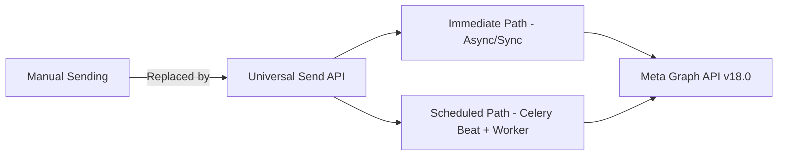

---

# 3. Technology Stack

| Layer | Technology |
|---|---|
| **Backend Framework** | Python 3.x, Django 5.0+, Django REST Framework 3.15+ |
| **Task Queue** | Celery 5.x (distributed task processing) |
| **Scheduler** | Celery Beat with `django-celery-beat` (DatabaseScheduler) |
| **Message Broker** | Redis (broker + result backend + rate limiter) |
| **Async HTTP** | `httpx` (async client for immediate sends) |
| **Sync HTTP** | `requests.Session` with connection pooling (Celery worker sends) |
| **Rate Limiting** | Redis Lua script (token bucket algorithm, ~50 tokens/sec) |
| **Database** | PostgreSQL with `SELECT FOR UPDATE SKIP LOCKED` |
| **Worker Pool** | Gevent (200 concurrent greenlets in production, autoscale 10-250 locally) |
| **Deployment** | Docker, Gunicorn, Railway (3-service Procfile: web + worker + beat) |

---

# 4. System Architecture

The architecture follows a **three-process model** deployed as separate services. The Django web server handles incoming API requests and decides whether to send messages immediately or schedule them for later. Celery Beat acts as the scheduler's clock, ticking every 1 second to check for due jobs. Celery Workers are the muscle — they pick up dispatched jobs from Redis and send messages to the Meta Graph API. This separation means each service can be scaled independently.

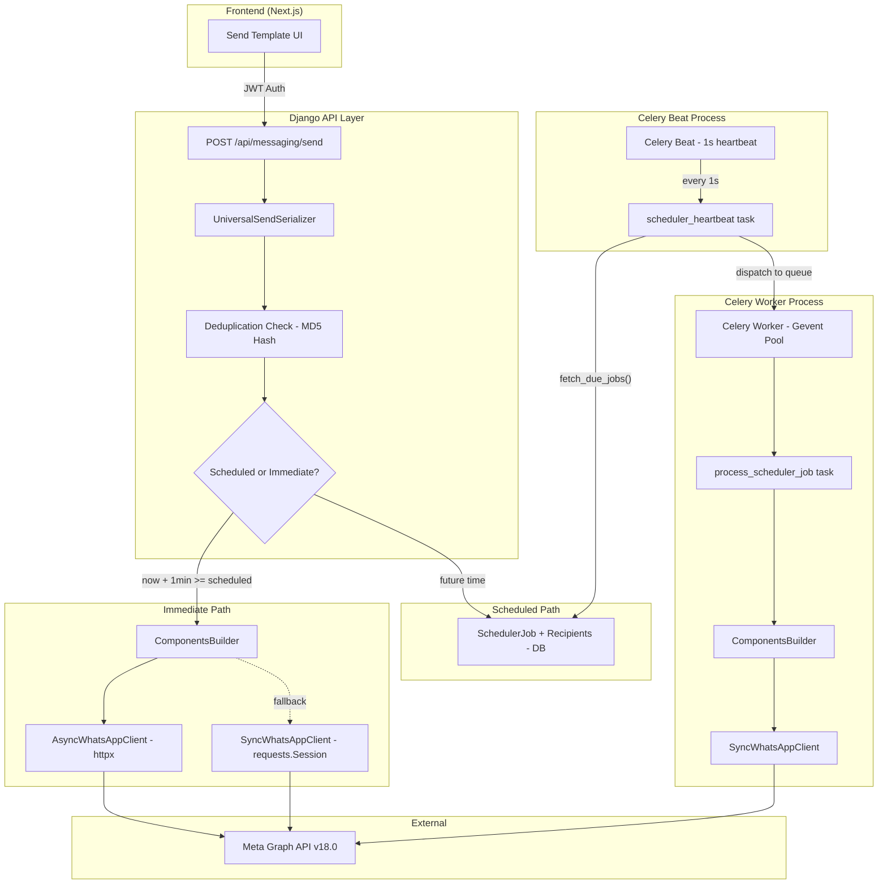

### Three-Process Architecture (from Procfile)

In production on Railway, we deploy three separate service types via a Procfile. Each runs as its own container/dyno, which means the web server never blocks on message sending, and the workers never interfere with API request handling. This is crucial for maintaining fast API response times even when sending millions of messages in the background.

```bash
# Railway Procfile — 3 separate services

# 1. Main Web API (Django + Gunicorn)
web: gunicorn core.wsgi:application --bind 0.0.0.0:${PORT} --workers 2 --threads 4

# 2. Celery Worker (Background job processor) — Gevent for low memory + high concurrency
worker: celery -A core worker -l info -P gevent -c 200 -Q celery,scheduler,jobs

# 3. Celery Beat (Scheduled task scheduler)
beat: celery -A core beat -l info --scheduler django_celery_beat.schedulers:DatabaseScheduler
```

| Service | Role | Concurrency |
|---|---|---|
| **Web** | Handles API requests, validates input, creates scheduled jobs | 2 workers × 4 threads |
| **Worker** | Processes jobs, sends messages via Graph API | 200 gevent greenlets (prod) / autoscale 10-250 (local) |
| **Beat** | Ticks every 1 second, dispatches due jobs to workers | Single process |

### 4.1 Django App Directory Structure

The system is divided into two primary Django apps: `messaging` (for immediate sends and component building) and `scheduler` (for background jobs, rate limiting, and celery tasks).

```text
Whatsapp-Marketing-Api/
├── messaging/                      # Immediate Send & Core Components
│   ├── models.py                   # Conversation & Message tracking
│   ├── serializers.py              # UniversalSendSerializer with strict validation
│   ├── universal_send.py           # UniversalSendService coordinating paths
│   ├── views.py                    # Unified POST /api/messaging/send endpoint
│   └── whatsapp_service.py         # ComponentsBuilder engine for universal components
│
├── scheduler/                      # Background Queue & Distribution
│   ├── models.py                   # SchedulerJob & SchedulerJobRecipient
│   ├── tasks.py                    # Celery beat heartbeat and worker processing logic
│   ├── views.py                    # Job management API (cancel, status, retry)
│   └── services/                   # Heavy lifting logic
│       ├── async_whatsapp.py       # Async httpx client for immediate sends
│       ├── phone_validation.py     # Recipient formatting verification
│       ├── rate_limiter.py         # Redis Lua token bucket rate limiter
│       ├── scheduler_service.py    # Job creation, IST->UTC, distributed locking
│       └── sync_whatsapp.py        # requests.Session client with connection pooling
```

---

# 5. The Universal Send API — Single Endpoint for Everything

The core design decision was creating **one unified endpoint** (`POST /api/messaging/send`) that handles both Standard and Carousel templates. Before this, the system had separate code paths for different template types, leading to code duplication and inconsistencies. By unifying everything behind a single API, the frontend only needs to adjust the `templateType` field — all the branching and component building happens server-side.

## 5.1 Unified JSON Format

### Standard Template Request

```json
{
    "phoneNumbers": ["919876543210", "919876543211"],
    "templateName": "welcome_offer",
    "language": "en_US",
    "templateType": "standard",
    "date": "2025-12-30",
    "time": "14:30",
    "header": {
        "type": "image",
        "url": "https://example.com/banner.jpg"
    },
    "bodyParams": ["John", "20% OFF"],
    "buttonParams": [
        {"sub_type": "quick_reply", "text": "Yes", "index": 0}
    ]
}
```

### Carousel Template Request

```json
{
    "phoneNumbers": ["919876543210"],
    "templateName": "product_showcase",
    "language": "en_US",
    "templateType": "carousel",
    "date": "2025-12-30",
    "time": "14:30",
    "bodyParams": ["Welcome to our store!"],
    "cards": [
        {
            "header": {"type": "image", "url": "https://example.com/p1.jpg"},
            "bodyParams": ["Product 1", "$99"],
            "buttonParams": [
                {"sub_type": "url", "text": "/product/1", "index": 0},
                {"sub_type": "quick_reply", "text": "Buy Now", "index": 1}
            ]
        },
        {
            "header": {"type": "image", "url": "https://example.com/p2.jpg"},
            "bodyParams": ["Product 2", "$149"],
            "buttonParams": [
                {"sub_type": "url", "text": "/product/2", "index": 0},
                {"sub_type": "quick_reply", "text": "Buy Now", "index": 1}
            ]
        }
    ]
}
```

## 5.2 Serializer with Cross-Field Validation

```python
class UniversalSendSerializer(serializers.Serializer):
    phoneNumbers = serializers.ListField(
        child=serializers.CharField(max_length=20),
        min_length=1
    )
    templateName = serializers.CharField(max_length=255)
    language = serializers.CharField(max_length=10, default='en_US')
    date = serializers.CharField(max_length=10)   # YYYY-MM-DD
    time = serializers.CharField(max_length=5)    # HH:MM
    templateType = serializers.ChoiceField(
        choices=['standard', 'carousel'], default='standard'
    )

    # Standard template fields
    header = HeaderSerializer(required=False)
    bodyParams = serializers.ListField(child=serializers.CharField(max_length=1024), required=False, default=list)
    buttonParams = ButtonParamSerializer(many=True, required=False, default=list)

    # Carousel template fields
    cards = CardSerializer(many=True, required=False, default=list)

    def validate(self, data):
        template_type = data.get('templateType', 'standard')

        if template_type == 'standard':
            if data.get('cards'):
                raise serializers.ValidationError({
                    'cards': 'Cards must be empty for standard templates.'
                })

        elif template_type == 'carousel':
            cards = data.get('cards', [])
            if len(cards) < 2:
                raise serializers.ValidationError({
                    'cards': 'Carousel templates require at least 2 cards.'
                })
            if len(cards) > 10:
                raise serializers.ValidationError({
                    'cards': 'Carousel templates support a maximum of 10 cards.'
                })
            if data.get('header'):
                raise serializers.ValidationError({
                    'header': 'Top-level header not allowed for carousel. Place headers inside each card.'
                })

        return data
```

### Validation Rules Summary

The serializer enforces strict cross-field validation rules to catch invalid payloads before they reach the service layer. This is especially important for carousel templates, which have a more complex structure than standard ones. By validating early, we avoid wasting time uploading media or calling the Meta API only to get a cryptic error back.

| Field | Rule |
|---|---|
| `phoneNumbers` | At least 1, each must be 10+ digits |
| `date` | Format `YYYY-MM-DD` |
| `time` | Format `HH:MM` |
| `templateType` | `standard` or `carousel` |
| Standard + cards | ❌ Not allowed — cards must be empty for standard |
| Carousel + header | ❌ Not allowed — headers go inside cards |
| Carousel cards | Min 2, Max 10 |

---

# 6. ComponentsBuilder — The Universal Component Engine

The **ComponentsBuilder** is the core design pattern that makes the system truly universal. Both Standard and Carousel templates flow through the same builder, producing a `components[]` array that the Meta Graph API expects. Without this abstraction, every place in the codebase that sends messages (immediate send, scheduled send, retry send) would need its own if/else logic for template types. The builder centralizes this complexity into one reusable class.

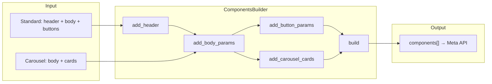

### Builder Implementation

```python
class ComponentsBuilder:
    def __init__(self):
        self._components = []
        self._carousel_cards = []

    def add_header(self, header_data):
        """Build header: image, video, document, text, product."""
        if header_data and header_data.get('type') == 'image':
            self._components.append({
                'type': 'header',
                'parameters': [{'type': 'image', 'image': {'link': header_data['url']}}]
            })
        # ... video, document, text handlers
        return self

    def add_body_params(self, body_params):
        if body_params:
            self._components.append({
                'type': 'body',
                'parameters': [{'type': 'text', 'text': str(p)} for p in body_params]
            })
        return self

    def add_button_params(self, button_params):
        for idx, btn in enumerate(button_params or []):
            self._components.append({
                'type': 'button',
                'sub_type': btn.get('sub_type', 'quick_reply'),
                'index': str(btn.get('index', idx)),
                'parameters': [{'type': 'text', 'text': btn['text']}] if btn.get('text') else []
            })
        return self

    def add_carousel_cards(self, cards):
        """Build Meta CAROUSEL structure with card_index."""
        meta_cards = []
        for idx, card in enumerate(cards):
            card_components = []
            # Card header
            header_component = self._build_header_component(card.get('header'))
            if header_component:
                card_components.append(header_component)
            # Card body
            body_component = self._build_body_component(card.get('bodyParams', []))
            if body_component:
                card_components.append(body_component)
            # Card buttons
            card_components.extend(self._build_button_components(card.get('buttonParams', [])))

            meta_cards.append({'card_index': idx, 'components': card_components})
        self._carousel_cards = meta_cards
        return self

    def build(self):
        result = list(self._components)
        if self._carousel_cards:
            result.append({'type': 'CAROUSEL', 'cards': self._carousel_cards})
        return result

    @classmethod
    def for_template_type(cls, template_type, header=None, body_params=None,
                          button_params=None, cards=None):
        """Universal factory — single entry point for all template types."""
        if template_type == 'carousel':
            return cls.for_carousel(cards=cards or [], body_params=body_params)
        else:
            return cls.for_standard(header=header, body_params=body_params,
                                    button_params=button_params)
```

### What ComponentsBuilder Produces

Here's what the builder outputs for each template type. The key difference is that standard templates have flat top-level components, while carousel templates wrap card-specific components inside a `CAROUSEL` container with `card_index` identifiers. Understanding this output format is critical because it must exactly match what the Meta Graph API expects — any structural deviation causes a `100` (Invalid Parameter) error.

**Standard Template Output:**
```json
[
    {"type": "header", "parameters": [{"type": "image", "image": {"link": "https://..."}}]},
    {"type": "body", "parameters": [{"type": "text", "text": "John"}, {"type": "text", "text": "20% OFF"}]},
    {"type": "button", "sub_type": "quick_reply", "index": "0", "parameters": [{"type": "payload", "payload": "Yes"}]}
]
```

**Carousel Template Output:**
```json
[
    {"type": "body", "parameters": [{"type": "text", "text": "Welcome"}]},
    {
        "type": "CAROUSEL",
        "cards": [
            {
                "card_index": 0,
                "components": [
                    {"type": "header", "parameters": [{"type": "image", "image": {"link": "https://...p1.jpg"}}]},
                    {"type": "body", "parameters": [{"type": "text", "text": "Product 1"}]},
                    {"type": "button", "sub_type": "quick_reply", "index": "0", "parameters": [{"type": "payload", "payload": "Buy Now"}]}
                ]
            },
            {
                "card_index": 1,
                "components": ["..."]
            }
        ]
    }
]
```

---

# 7. Immediate vs Scheduled — The Decision Logic

When a send request comes in, the system must decide: should we send the messages right now, or store them in the database for later processing? This decision is based on the scheduled time the user provides. The sequence diagram below illustrates both paths — notice how the immediate path bypasses the database entirely (faster for the user), while the scheduled path creates persistent records that survive server restarts.

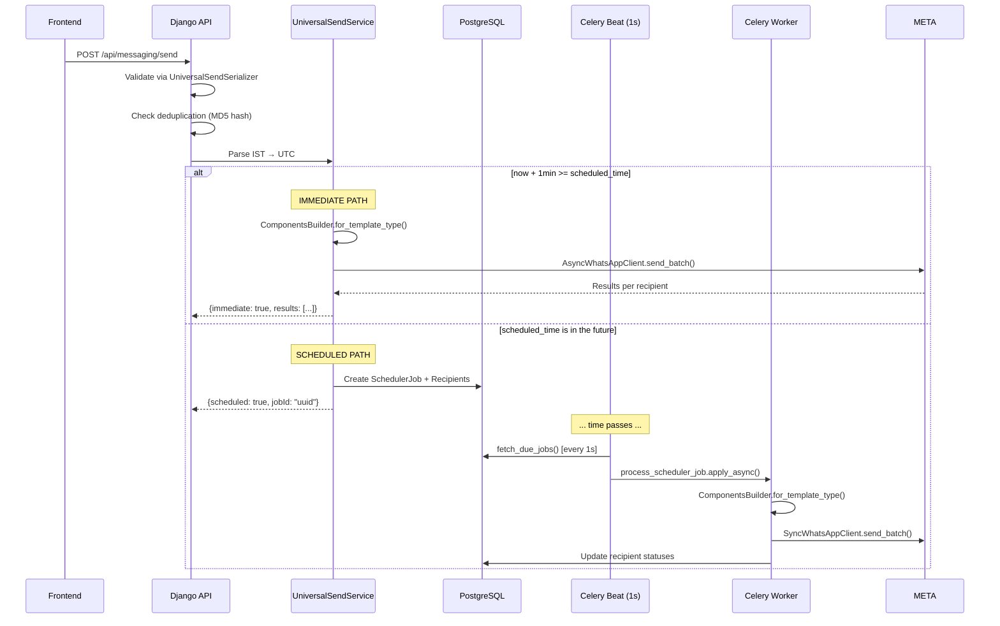

### The 1-Minute Buffer Logic

```python
# Parse IST to UTC
scheduled_utc = service.parse_ist_to_utc(data['date'], data['time'])

# Check if should process immediately
now = timezone.now()
buffer_time = now + timedelta(minutes=1)

if buffer_time >= scheduled_utc:
    # Send NOW — time is in the past or within 1 minute
    results = service.send_immediate(...)
else:
    # Schedule for later — create SchedulerJob in DB
    job = service.create_scheduled_job(...)
```

**Why 1-minute buffer?** If a user schedules a message for "right now" or within the next 60 seconds, there's no point creating a SchedulerJob, waiting for Beat to pick it up, and then dispatching to a Worker. We send immediately instead.

### IST → UTC Conversion

```python
IST = pytz.timezone('Asia/Kolkata')

@staticmethod
def parse_ist_to_utc(date_str: str, time_str: str) -> datetime:
    year, month, day = map(int, date_str.split('-'))
    hour, minute = map(int, time_str.split(':'))
    ist_dt = IST.localize(datetime(year, month, day, hour, minute, 0))
    return ist_dt.astimezone(pytz.UTC)
```

All scheduling internally uses **UTC**. The IST conversion happens only at the API boundary.

---

# 8. Deduplication via MD5 Hashing

In a production environment, duplicate API requests are inevitable — users double-click buttons, browsers retry failed requests, and network issues cause repeated submissions. Without deduplication, a user could accidentally send the same campaign twice, wasting message credits and annoying recipients. We solve this with a simple but effective MD5 hash of all request parameters.

```python
@staticmethod
def create_request_hash(phone_numbers, template_name, template_type,
                        date_str, time_str, body_params=None,
                        button_params=None, cards=None):
    hash_parts = [
        template_name,
        template_type,
        ','.join(sorted(phone_numbers)),
        date_str,
        time_str,
    ]
    if body_params:
        hash_parts.append(json.dumps(body_params, sort_keys=True))
    if button_params:
        hash_parts.append(json.dumps(button_params, sort_keys=True))
    if cards:
        hash_parts.append(json.dumps(cards, sort_keys=True))

    hash_source = "-".join(hash_parts)
    return hashlib.md5(hash_source.encode()).hexdigest()
```

Before creating a job, we check:

```python
if SchedulerJob.objects.filter(
    job_hash=request_hash,
    status__in=[SchedulerJobStatus.PENDING, SchedulerJobStatus.PROCESSING]
).exists():
    return Response(
        {"error": "Duplicate request detected"},
        status=status.HTTP_409_CONFLICT
    )
```

---

# 9. Database Models — SchedulerJob & SchedulerJobRecipient

The scheduler's data model is designed around two key principles: (1) **job-level tracking** for the overall campaign status, and (2) **recipient-level tracking** for per-user delivery results. This two-table design enables error isolation — if sending to one phone number fails, we can retry just that recipient without re-processing the entire job. The ER diagram below shows the complete model structure.

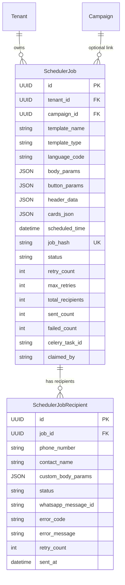

### Key Design Decisions

| Decision | Rationale |
|---|---|
| **`template_type` field** | Distinguishes standard vs carousel for correct ComponentsBuilder path |
| **`header_data` (JSON)** | Stores full header config (type, url, text, etc.) for replay at scheduled time |
| **`cards_json` (JSON)** | Stores complete carousel cards array for faithful replay |
| **`job_hash` (unique)** | MD5 deduplication — prevents duplicate campaigns |
| **`claimed_by`** | Distributed locking — tracks which server claimed the job |
| **Per-recipient `custom_body_params`** | Personalization — each recipient can have unique body variables |
| **Per-recipient `status`** | Error isolation — one failure doesn't affect others |

---

# 10. Celery Beat Heartbeat — The Scheduler Engine

This is the **core timing mechanism** of the entire system. Unlike cron jobs that run at minute-level granularity, Celery Beat can tick at sub-second intervals. We configure it to trigger every 1 second, giving us near-real-time job dispatch. Beat itself does NOT process jobs — it only checks which jobs are due and pushes them into the Redis queue for workers to pick up. This separation is critical because Beat is a single process, while workers can scale to hundreds.

## 10.1 Celery Configuration (`core/celery.py`)

```python
from celery import Celery

app = Celery('whatsapp_marketing')
app.config_from_object('django.conf:settings', namespace='CELERY')
app.autodiscover_tasks()

# Beat schedule — the heartbeat configuration
app.conf.beat_schedule = {
    'scheduler-heartbeat': {
        'task': 'scheduler.tasks.scheduler_heartbeat',
        'schedule': 1.0,  # ⚡ Every 1 second — fast pickup
        'options': {'queue': 'scheduler'}
    },
    'scheduler-cleanup': {
        'task': 'scheduler.tasks.cleanup_stale_jobs',
        'schedule': 300.0,  # Every 5 minutes
        'options': {'queue': 'scheduler'}
    },
}
```

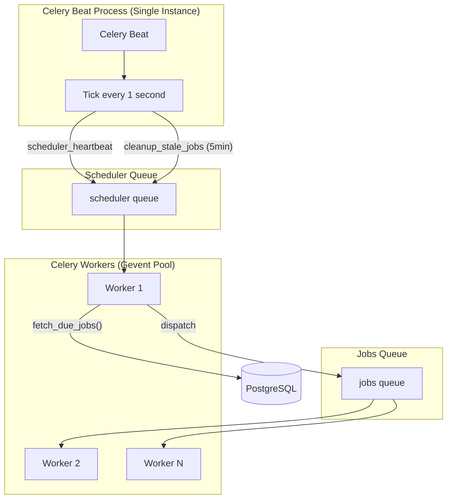

## 10.2 The Heartbeat Task

```python
@shared_task(name='scheduler.tasks.scheduler_heartbeat')
def scheduler_heartbeat():
    """
    Main scheduler heartbeat — runs every 1 second via Celery Beat.
    Fetches due jobs and dispatches them for processing.
    Uses distributed locking to prevent race conditions.
    """
    service = SchedulerService()
    job_ids = service.fetch_due_jobs()

    if not job_ids:
        logger.debug('No due jobs found')
        return {'dispatched': 0, 'timestamp': timezone.now().isoformat()}

    # Dispatch each job to separate task for PARALLEL processing
    for job_id in job_ids:
        task_id = f'scheduler-job-{job_id}'
        process_scheduler_job.apply_async(
            args=[job_id],
            queue='jobs',
            task_id=task_id  # Prevents duplicate tasks for same job
        )

    logger.info(f'Dispatched {len(job_ids)} jobs for processing')
    return {'dispatched': len(job_ids), 'timestamp': timezone.now().isoformat()}
```

### Heartbeat Timing Explained

| Parameter | Value | Explanation |
|---|---|---|
| **Beat interval** | 1 second | How often Celery Beat triggers `scheduler_heartbeat` |
| **Max pickup delay** | ~1 second | Worst case: job becomes due 1ms after a heartbeat tick |
| **Avg pickup delay** | ~0.5 seconds | On average, half the interval |
| **Cleanup interval** | 5 minutes | How often stale jobs are detected and reset |
| **Stale threshold** | 10 minutes | Jobs stuck in `PROCESSING` for 10+ min are considered stale |

## 10.3 Distributed Locking — `fetch_due_jobs()`

```python
class SchedulerService:
    RETRY_DELAYS = [60, 300, 900]  # 1min, 5min, 15min
    BATCH_SIZE = 20
    SERVER_ID = 'server_01'

    def fetch_due_jobs(self, limit=None):
        limit = limit or self.BATCH_SIZE
        now = timezone.now()

        with transaction.atomic():
            # SELECT FOR UPDATE SKIP LOCKED — distributed locking
            due_jobs = SchedulerJob.objects.select_for_update(
                skip_locked=True  # Skip rows locked by other workers
            ).filter(
                Q(status=SchedulerJobStatus.PENDING, scheduled_time__lte=now) |
                Q(
                    status=SchedulerJobStatus.FAILED,
                    next_retry_at__lte=now,
                    retry_count__lt=F('max_retries')
                )
            ).order_by('priority', 'scheduled_time')[:limit]

            job_ids = list(due_jobs.values_list('id', flat=True))

            if not job_ids:
                return []

            # Mark as PROCESSING — claimed by this server
            SchedulerJob.objects.filter(id__in=job_ids).update(
                status=SchedulerJobStatus.PROCESSING,
                processing_started_at=now,
                claimed_by=self.SERVER_ID,
                claimed_at=now
            )

        return [str(jid) for jid in job_ids]
```

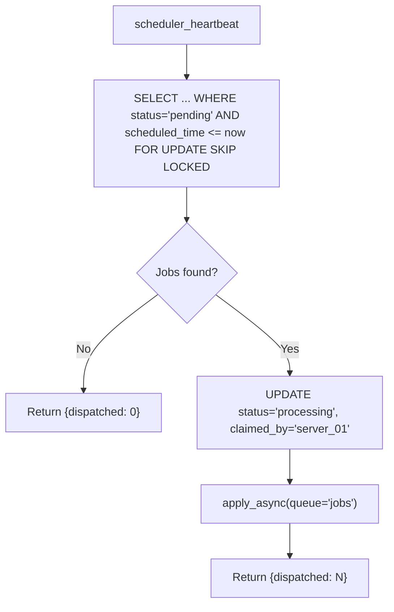

### Why `SELECT FOR UPDATE SKIP LOCKED`?

In a multi-server deployment, multiple Beat instances or workers could try to pick up the same job simultaneously. Without distributed locking, this would cause duplicate message sends. PostgreSQL's `SELECT FOR UPDATE SKIP LOCKED` clause solves this elegantly at the database level — no external locking service (like Redis-based locks or ZooKeeper) needed.

Here's how it works in practice:

- If Server A locks Job #1, Server B **skips** it (doesn't block or wait)
- No race conditions, no duplicate processing
- Non-blocking — workers never wait for other workers

---

# 11. Celery Worker — Job Processing Engine

## 11.1 The `process_scheduler_job` Task

This is the **heavy lifter** — where actual messages get sent to the Meta Graph API.

```python
@shared_task(name='scheduler.tasks.process_scheduler_job', bind=True, max_retries=0)
def process_scheduler_job(self, job_id: str):
    job = SchedulerJob.objects.select_related('tenant').get(id=job_id)

    # Prevent duplicate processing
    if job.status != SchedulerJobStatus.PROCESSING:
        return {'status': 'skipped', 'reason': f'Job status is {job.status}'}

    # Store Celery task ID for tracking
    job.celery_task_id = self.request.id or ''
    job.save(update_fields=['celery_task_id'])

    # Get WhatsApp client for tenant
    client = SyncWhatsAppClient.from_tenant(job.tenant)

    # Get pending recipients
    service = SchedulerService()
    recipients = service.get_job_pending_recipients(job_id)

    # Detect v2 job (carousel or advanced headers)
    is_v2_job = bool(
        job.template_type != 'standard'
        or job.header_data
        or job.cards_json
    )

    if is_v2_job:
        # V2 PATH: ComponentsBuilder for universal component generation
        components = ComponentsBuilder.for_template_type(
            template_type=job.template_type,
            header=job.header_data or None,
            body_params=job.body_params or None,
            button_params=job.button_params or None,
            cards=job.cards_json or None
        )
        results = client.send_batch_with_components(
            recipients=recipient_data,
            template_name=meta_template_id,
            language_code=job.language_code,
            components=components,
            delay_between=0.2  # 200ms rate limit
        )
    else:
        # LEGACY V1 PATH: flat parameters (backward compatible)
        results = client.send_batch(
            recipients=recipient_data,
            template_name=meta_template_id,
            language_code=job.language_code,
            header_image=job.header_image_url or None,
            body_params=job.body_params,
            button_params=job.button_params,
            delay_between=0.2
        )

    # Update each recipient independently (error isolation)
    for result in results:
        recipient = phone_to_recipient.get(result.phone)
        service.update_recipient_result(
            recipient=recipient,
            success=result.success,
            message_id=result.message_id,
            error_code=result.error_code,
            error_message=result.error_message
        )

    # Update job completion status
    service.update_job_completion(job_id)
```

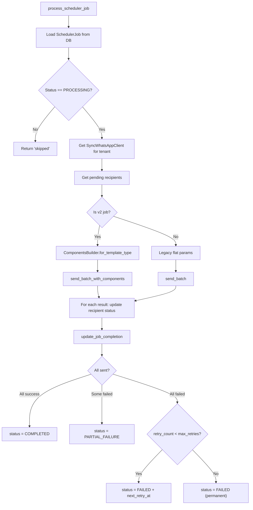

## 11.2 Worker Scaling & Concurrency

One of the most impactful architectural decisions was choosing **Gevent** as the Celery worker pool instead of the default **prefork** (multiprocessing) pool. Since our workers are I/O-bound (they spend most of their time waiting for HTTP responses from the Meta API), Gevent's lightweight greenlets are far more efficient than OS-level processes. A single server can run 200 Gevent greenlets in ~50-100MB of RAM, whereas 200 prefork processes would consume 200× the memory.

### Production (Railway — Procfile)

```bash
worker: celery -A core worker -l info -P gevent -c 200 -Q celery,scheduler,jobs
```

- **Pool**: `gevent` — lightweight greenlets (not OS threads/processes)
- **Concurrency**: 200 simultaneous tasks
- **Memory**: ~50-100MB total (vs 200× process memory with prefork)
- **Queues**: Listens on `celery`, `scheduler`, and `jobs`

### Local Development (start_services.sh)

```bash
celery -A core worker -l info --autoscale=250,10 -Q celery,scheduler,jobs
```

- **Autoscale**: Dynamically scales between 10 (idle) and 250 (peak) workers
- **Throughput**: ~50 msg/sec (idle) → ~1,250 msg/sec (peak)
- **1,000,000 messages**: ~13 minutes at peak autoscale!

### Capacity Calculation

The table below shows theoretical throughput at different worker counts. The 200ms delay between messages is our rate-limiting mechanism (via the Redis token bucket). In practice, actual throughput may be slightly lower due to network latency and Meta API response times, but these numbers are representative of what we've observed in production testing.

| Workers | Delay | Throughput | 1M messages |
|---|---|---|---|
| 10 (idle) | 200ms | ~50 msg/sec | ~5.5 hours |
| 50 | 200ms | ~250 msg/sec | ~67 minutes |
| 100 | 200ms | ~500 msg/sec | ~33 minutes |
| 250 (peak) | 200ms | ~1,250 msg/sec | ~13 minutes |

---

# 12. SyncWhatsAppClient — Production-Grade HTTP Client

The `SyncWhatsAppClient` is used by Celery Workers for actual message delivery during scheduled sends. It's designed for high-load scenarios where thousands of messages are sent in rapid succession. The key optimization here is **connection pooling** — instead of opening a new TCP connection for every message (which incurs TLS handshake overhead each time), we maintain a pool of persistent connections that are reused across requests. This dramatically reduces latency and prevents connection exhaustion.

```python
class SyncWhatsAppClient:
    """Production-grade synchronous WhatsApp Cloud API client."""

    def __init__(self, phone_id, access_token, max_retries=3,
                 timeout=(10, 30), pool_connections=20, pool_maxsize=100):
        self.session = self._create_session(max_retries, pool_connections, pool_maxsize)
        self.session.headers.update({
            'Authorization': f'Bearer {access_token}',
            'Content-Type': 'application/json'
        })

    def _create_session(self, max_retries, pool_connections, pool_maxsize):
        session = requests.Session()

        # Retry strategy: retry on 429, 500, 502, 503, 504
        retry_strategy = Retry(
            total=max_retries,
            backoff_factor=0.5,
            status_forcelist=[429, 500, 502, 503, 504],
            allowed_methods=["POST"]
        )

        # Connection pooling: 20 pools × 100 connections each
        adapter = HTTPAdapter(
            max_retries=retry_strategy,
            pool_connections=pool_connections,
            pool_maxsize=pool_maxsize
        )
        session.mount('https://', adapter)
        return session
```

### Connection Pooling Explained

Connection pooling is how we avoid the overhead of establishing a new HTTPS connection for every single message. Each connection in the pool maintains a persistent TCP socket with TLS already negotiated. When a worker needs to send a message, it borrows a connection from the pool, uses it, and returns it. The retry strategy also handles transient failures automatically — if Meta returns a `429` (rate limit) or `502` (bad gateway), the client automatically retries with exponential backoff (0.5s, 1s, 2s).

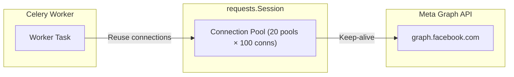

| Parameter | Value | Purpose |
|---|---|---|
| `pool_connections` | 20 | Number of connection pools to cache |
| `pool_maxsize` | 100 | Maximum connections per pool |
| `timeout` | (10, 30) | 10s connect, 30s read |
| `max_retries` | 3 | Auto-retry on 429/5xx |
| `backoff_factor` | 0.5 | Retry delays: 0.5s, 1s, 2s |

---

# 13. The Role of Redis: Scaling & Rate Limiting

In modern backend architectures, simply writing an API endpoint isn't enough when you're dealing with external rate limits and high-volume workloads. **Redis** serves as a foundational infrastructure component in this system, acting as both the message broker and a high-performance distributed rate limiter.

## 13.1 Redis in Docker

Our Docker configuration defines Redis as a core service:

```yaml
# docker-compose.prod.yml
redis:
  image: redis:7-alpine
  command: redis-server --maxmemory 256mb --maxmemory-policy allkeys-lru
  volumes:
    - redis_data:/data
  healthcheck:
    test: ["CMD", "redis-cli", "ping"]
    interval: 10s
    timeout: 5s
    retries: 5
```

By setting `--maxmemory-policy allkeys-lru`, we ensure that if Redis ever hits its 256MB memory cap, it automatically evicts the least recently used keys — preventing container crashes while keeping active data intact.

## 13.2 Redis as Celery Broker and Result Backend

Celery requires a "broker" to pass messages between the Django web application and the Celery workers. In our Django `settings.py`:

```python
# Celery Configuration
CELERY_BROKER_URL = os.getenv('CELERY_BROKER_URL', 'redis://localhost:6379/0')
CELERY_RESULT_BACKEND = os.getenv('CELERY_RESULT_BACKEND', 'redis://localhost:6379/0')
CELERY_ACCEPT_CONTENT = ['json']
CELERY_TASK_SERIALIZER = 'json'
CELERY_RESULT_SERIALIZER = 'json'
CELERY_TIMEZONE = 'Asia/Kolkata'
CELERY_TASK_TRACK_STARTED = True
CELERY_TASK_TIME_LIMIT = 30 * 60  # 30 minutes max per task
```

**How it works:**

1. **Publishing Tasks**: When Celery Beat ticks (every 1 second), or when the API dispatches an immediate send, the task payload is serialized to JSON and pushed into a Redis list (queue).
2. **Worker Consumption**: The Celery Gevent workers continuously listen to Redis via `BRPOP`. When a task appears in the queue, an idle greenlet instantly picks it up and begins execution.
3. **Result Storage**: After a task completes, its return value and status (`SUCCESS`, `FAILURE`) are written back to Redis as the "Result Backend", allowing the system to track task state.

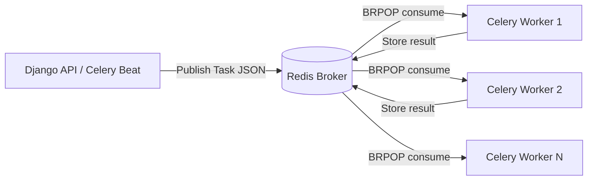

### Task Routing via Redis Queues

We use three separate Redis queues for different workload types:

```python
CELERY_TASK_ROUTES = {
    'scheduler.tasks.scheduler_heartbeat': {'queue': 'scheduler'},
    'scheduler.tasks.cleanup_stale_jobs': {'queue': 'scheduler'},
    'scheduler.tasks.process_scheduler_job': {'queue': 'jobs'},
    'messaging.tasks.*': {'queue': 'celery'},
}
CELERY_TASK_DEFAULT_QUEUE = 'celery'
```

| Queue | Purpose | Tasks |
|---|---|---|
| `scheduler` | Lightweight coordination tasks | `scheduler_heartbeat`, `cleanup_stale_jobs` |
| `jobs` | Heavy job processing tasks | `process_scheduler_job` |
| `celery` | General messaging tasks | `send_message_task`, `send_campaign_messages_task` |

This separation ensures that a flood of message-sending tasks in the `jobs` queue doesn't starve the heartbeat task in the `scheduler` queue.

## 13.3 Overcoming Meta's Rate Limits using a Distributed Token Bucket

The Meta WhatsApp Cloud API limits requests to **~80 messages per second**. 

If we process 200 concurrent Celery tasks without coordination, Meta returns `429 Too Many Requests`. Since 200 isolated Gevent workers don't share Python memory, we cannot use simple `time.sleep()`. We need a **distributed, atomic rate limiter**.

We built a **Token Bucket Algorithm** backed by Redis and executed via a Lua script. Lua scripts run atomically, meaning no two workers can modify the key at the exact same millisecond, completely eliminating race conditions.

```python
class RateLimiter:
    """Token bucket rate limiter using Redis."""

    SCRIPT = """
    local key = KEYS[1]
    local max_tokens = tonumber(ARGV[1])
    local refill_rate = tonumber(ARGV[2])
    local now = tonumber(ARGV[3])
    local requested = tonumber(ARGV[4])

    -- Get current state
    local data = redis.call('HMGET', key, 'tokens', 'last_refill')
    local tokens = tonumber(data[1]) or max_tokens
    local last_refill = tonumber(data[2]) or now

    -- Calculate tokens based on elapsed time
    local elapsed = now - last_refill
    tokens = math.min(max_tokens, tokens + elapsed * refill_rate)

    -- If enough tokens, consume them and update state
    if tokens >= requested then
        redis.call('HMSET', key, 'tokens', tokens - requested, 'last_refill', now)
        redis.call('EXPIRE', key, 60)
        return 1  -- Acquired
    end
    return 0  -- Denied
    """

    def __init__(self, max_tokens=50, refill_rate=50.0, key_prefix='scheduler'):
        self.redis = redis.from_url(settings.CELERY_BROKER_URL)
        self.max_tokens = max_tokens
        self.refill_rate = refill_rate

    def acquire(self, tokens=1, timeout=30.0):
        """Acquire tokens, blocking until available or timeout."""
        start = time.time()
        while True:
            # Try to acquire tokens atomically via Lua script
            result = self._get_script()(
                keys=[self.key],
                args=[self.max_tokens, self.refill_rate, time.time(), tokens]
            )
            if result == 1:
                return True

            elapsed = time.time() - start
            if elapsed >= timeout:
                return False

            # Sleep briefly and retry
            time.sleep(0.02)
```

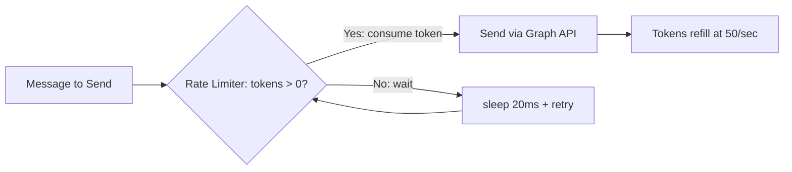

### How the Token Bucket Rate Limiter works:

1. **Bucket Initialization**: The bucket holds 50 tokens and refills at 50 tokens per second.
2. **Worker Request**: Before sending a WhatsApp message, a Celery worker asks Redis for 1 token.
3. **Atomic Check**: Redis checks the bucket via Lua. If tokens are there, minus 1 token and grant the worker permission.
4. **Throttling**: If empty (meaning 50 workers just sent messages this second), it returns `0`. The Python code then sleeps for `20ms` (`time.sleep(0.02)`) and retries.

This guarantees that **no matter how many autoscale workers we spin up** (even 250), the system strictly emits exactly ~50 requests per second across the entire cluster.

### Dynamic Rate Limiting (Async Client)

For immediate, non-queued dispatches using the `AsyncWhatsAppClient`, we also use dynamic delays based on batch sizes so we don't accidentally exceed spikes:

```python
# Dynamic rate limiting based on batch size
if delay_ms is None:
    batch_size = len(recipients)
    if batch_size <= 50:
        delay_ms = 0       # Instant for small batches
    elif batch_size <= 200:
        delay_ms = 10      # ~100 msg/sec
    elif batch_size <= 500:
        delay_ms = 25      # ~40 msg/sec
    else:
        delay_ms = 50      # ~20 msg/sec for large batches
```

---

# 14. Retry & Fault Tolerance

## 14.1 Job-Level Retry (Exponential Backoff)

```python
RETRY_DELAYS = [60, 300, 900]  # 1min, 5min, 15min

def update_job_completion(self, job_id, error_message=None):
    sent = job.recipients.filter(status=RecipientStatus.SENT).count()
    failed = job.recipients.filter(status=RecipientStatus.FAILED).count()

    if sent == total:
        job.status = SchedulerJobStatus.COMPLETED
    elif sent > 0:
        job.status = SchedulerJobStatus.PARTIAL_FAILURE
    else:
        # All failed — schedule retry
        if job.retry_count < job.max_retries:
            job.retry_count += 1
            delay = self.RETRY_DELAYS[min(job.retry_count - 1, 2)]
            job.next_retry_at = timezone.now() + timedelta(seconds=delay)
            job.status = SchedulerJobStatus.FAILED
        else:
            job.status = SchedulerJobStatus.FAILED  # Permanent
```

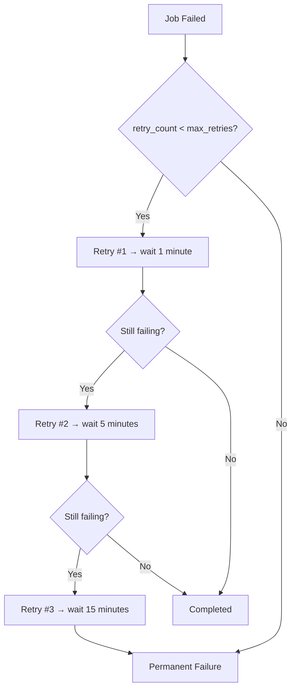

## 14.2 Stale Job Cleanup

```python
@shared_task(name='scheduler.tasks.cleanup_stale_jobs')
def cleanup_stale_jobs():
    """Runs every 5 minutes. Resets jobs stuck in PROCESSING for 10+ minutes."""
    service = SchedulerService()
    reset_count = service.cleanup_stale_jobs(stale_minutes=10)
    return {'reset_count': reset_count}
```

If a Worker crashes mid-processing, the job stays in `PROCESSING` forever. The cleanup task detects this and either retries or marks it as permanently failed.

---

# 15. Complete API Endpoints

| Endpoint | Method | Description |
|---|---|---|
| `/api/messaging/send` | POST | **Universal Send** — Standard + Carousel, Immediate + Scheduled |
| `/api/scheduler/jobs/` | GET | List jobs for tenant |
| `/api/scheduler/jobs/` | POST | Create scheduler job directly |
| `/api/scheduler/jobs/{id}/` | GET | Job details with recipients |
| `/api/scheduler/jobs/{id}/` | DELETE | Cancel pending job |
| `/api/scheduler/jobs/{id}/status/` | GET | Poll job status |
| `/api/scheduler/jobs/{id}/retry/` | POST | Retry failed recipients |
| `/api/scheduler/jobs/{id}/recipients/` | GET | List recipients with status filter |
| `/api/scheduler/jobs/stats/` | GET | Scheduler statistics |

---

# 16. End-to-End Flow — Complete Timeline

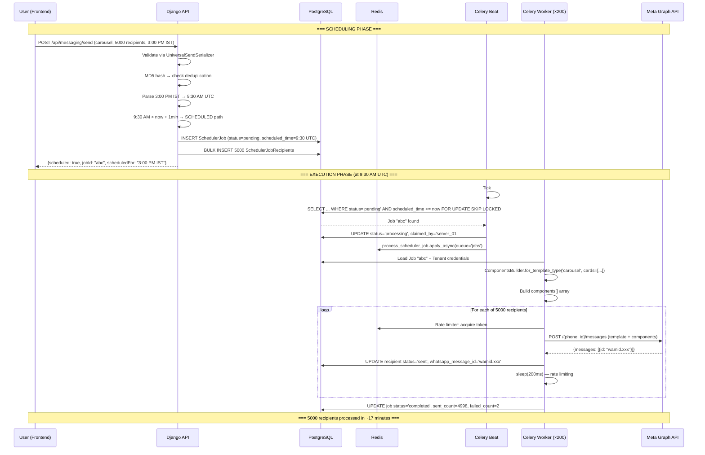

---

# 17. Key Learnings

- **Celery Beat + Worker separation** — Beat is the "brain" (decides WHEN), Workers are the "muscles" (do the WORK)
- **`SELECT FOR UPDATE SKIP LOCKED`** — PostgreSQL's distributed lock mechanism is incredibly powerful for preventing race conditions without blocking
- **Gevent vs Prefork** — Gevent greenlets use ~1000× less memory than prefork processes for I/O-bound tasks like HTTP calls
- **ComponentsBuilder pattern** — A single builder that handles all template types eliminates if/else sprawl and makes adding new types trivial
- **Error isolation** — Processing recipients independently means one bad phone number doesn't tank the entire campaign
- **Token bucket rate limiting** — Lua scripts in Redis provide atomic, distributed rate limiting that works across multiple workers
- **MD5 deduplication** — Simple but effective way to prevent duplicate campaigns at the API level
- **IST → UTC at the boundary** — Always store/compare in UTC; convert only at API boundaries
- **Autoscale for development** — `--autoscale=250,10` lets your local machine handle production-like loads during testing

---

# 18. Outcome

Successfully built a **production-grade, Celery-powered distributed message delivery system** that:

- Sends **Standard and Carousel** WhatsApp templates via a **single unified API endpoint**
- Supports **immediate and scheduled** delivery with IST → UTC conversion
- Uses **Celery Beat (1-second heartbeat)** for near-real-time job dispatch
- Uses **Celery Workers (200 gevent greenlets)** for high-concurrency message sending
- Implements **distributed locking** via PostgreSQL's `SELECT FOR UPDATE SKIP LOCKED`
- Provides **MD5 deduplication** to prevent accidental duplicate campaigns
- Ensures **error isolation** — one recipient failure never blocks others
- Retries failures with **exponential backoff** (1min → 5min → 15min)
- Respects Meta API rate limits via **Redis token bucket** (~50 tokens/sec)
- Scales to **1,000,000+ messages** in ~13 minutes at peak autoscale
- Maintains **backward compatibility** with legacy v1 flat-parameter templates

---

# 19. Future Improvements

- Add **webhook-based delivery status updates** (delivered, read, failed) via Meta Webhooks
- Implement **recipient-level personalization** — unique body params per contact from CSV/contact fields
- Add **A/B testing** — split recipients across template variants and track performance
- Implement **priority queuing** — urgent messages processed before bulk campaigns
- Add **real-time progress dashboard** — WebSocket-based live progress bar during job execution
- Implement **message batching within recipients** — process 1000 recipients per job for faster parallel execution

---

# Conclusion

This project at Curlshell significantly deepened my understanding of **distributed systems**, **task queue architecture**, and **production-grade API design**. Building a system that handles millions of messages reliably taught me that the challenge isn't just "calling an API" — it's about **scheduling, locking, rate limiting, fault tolerance, and observability**.

The combination of **Celery Beat** (for timing), **Celery Workers with Gevent** (for concurrency), **PostgreSQL** (for distributed locking), **Redis** (for message brokering and rate limiting), and **ComponentsBuilder** (for template abstraction) creates a robust architecture that can scale from a single developer's laptop to a production cloud deployment.
