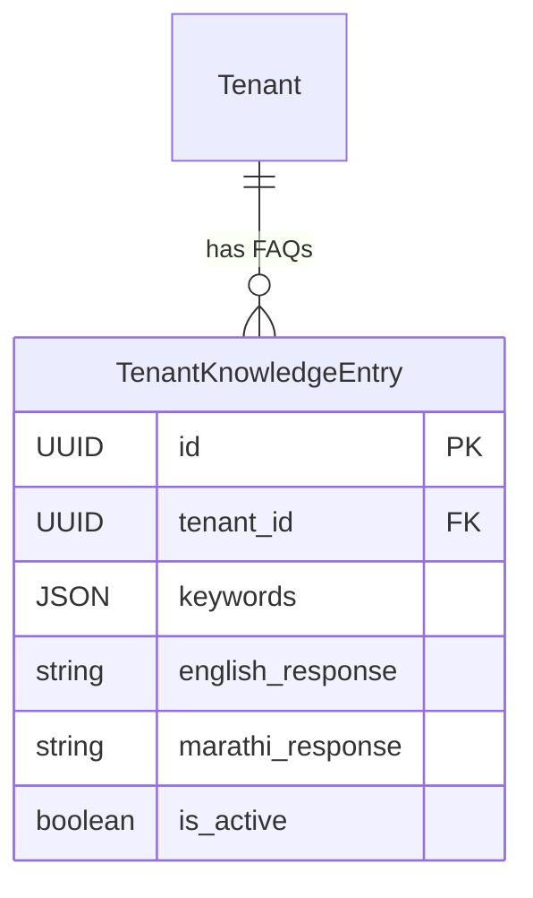
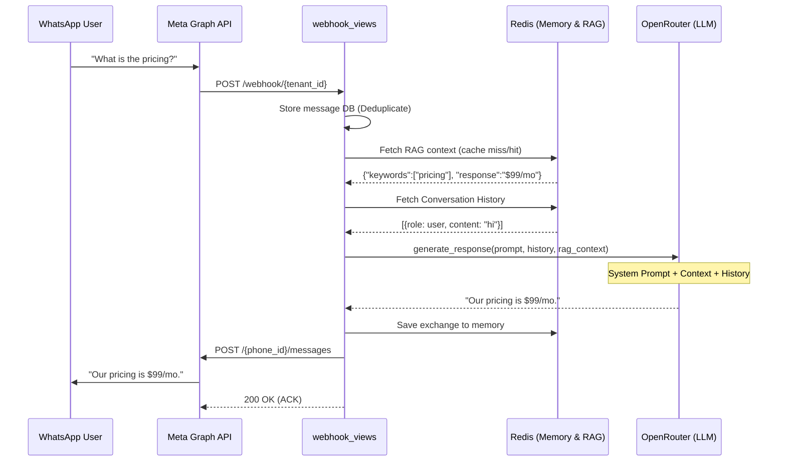

# Building a Multi-Tenant WhatsApp AI Chatbot with OpenRouter, RAG, and Vision Capabilities

Company: Curlshell Pvt. Ltd.  
Intern: Om Ghante  
Role: Software Developer Intern  
Duration: Dec 2025 - Present

---

# 1. Project Overview

After successfully automating the creation, approval, and sending of WhatsApp templates, the final piece of the WhatsApp Marketing ecosystem is **handling inbound replies**. I designed and integrated a **Multi-Tenant WhatsApp AI Chatbot** that acts as a 24/7 intelligent assistant for every tenant on the platform.

This chatbot doesn't just reply to text; it understands context, queries a per-tenant Knowledge Base (RAG), remembers conversation history, processes images using Vision models, extracts text from PDFs, and even detects the user's language (English/Marathi) for localized responses.

---

# 2. Problem Statement & Key Features

Building a chatbot over WhatsApp presents unique architectural challenges:
1. **Multi-Tenancy** — Every tenant (client) needs their own custom bot name, knowledge base, and webhook URL without overlapping data.
2. **Speed & Rate Limits** — WhatsApp requires webhooks to be acknowledged quickly, or it retries sending the message.
3. **Multimedia Chaos** — Users send text, voice notes, stickers, PDFs, and images. The bot must handle all of these gracefully.
4. **Context Window Limitations** — Feeding the entire conversation history into an LLM on every message is expensive and slow.

### Key Features Implemented:
- **Per-Tenant Webhook Architecture** — Dynamic URLs (`/api/wa-chatbot/webhook/{tenant_id}/`).
- **OpenRouter Auto-Routing** — Using `openrouter/auto` for text and `openai/gpt-4o` for vision tasks.
- **Tenant-Specific RAG** — Django cache-backed Knowledge Base lookups to answer FAQs accurately.
- **Conversation State Management** — Redis-backed conversation sliding window (last 15 exchanges).
- **Omnichannel Media Processing** — AI vision for images, native text extraction for PDFs.

---

# 3. System Architecture

The overarching system orchestrates incoming Meta webhooks, routes them through a series of specialized services, interacts with the LLM via OpenRouter, and dispatches the reply back via the Meta Graph API.

```mermaid
flowchart TD
    subgraph "Meta Graph API"
        WH[Incoming Webhook]
        SND[Send Message API]
    end

    subgraph "Django API (wavi)"
        ENTRY[TenantWebhookView]
        HANDLER[WhatsAppChatbotHandler]
        
        subgraph "AI Services"
            RAG[TenantRAGService]
            MEM[ConversationManager]
            MEDIA[MediaProcessor]
            LLM[OpenRouterService]
        end
        
        DB[(PostgreSQL)]
        CACHE[(Redis Cache)]
    end

    WH -->|POST /webhook/{id}| ENTRY
    ENTRY -->|Verify & Deduplicate| DB
    ENTRY -->|Route Msg| HANDLER
    
    HANDLER -->|Fetch Context| RAG
    RAG <--> CACHE
    
    HANDLER -->|Fetch History| MEM
    MEM <--> CACHE
    
    HANDLER -->|Process Image/PDF| MEDIA
    MEDIA --> LLM
    
    HANDLER -->|Generate Reply| LLM
    LLM --> HANDLER
    
    HANDLER --> SND
```

### 3.1 Django App Directory Structure (`wa_chatbot`)

To keep the system modular and maintainable, the business logic (AI, memory, API clients) is completely decoupled from the Django views.

```text
wa_chatbot/
├── migrations/             # Database migrations for the app
├── services/               # Core business logic and AI integrations
│   ├── conversation_manager.py # Redis sliding window memory for LLM context
│   ├── language_detector.py    # English/Marathi detection logic
│   ├── media_processor.py      # Vision processing for images & PyPDF2 for docs
│   ├── openrouter_service.py   # LLM integration via OpenRouter API
│   ├── rag_service.py          # Global fallback Knowledge Base
│   ├── tenant_rag_service.py   # Tenant-aware caching RAG system
│   └── whatsapp_client.py      # WhatsApp Graph API client wrapper
├── __init__.py
├── api_views.py            # Local testing & Knowledge Base CRUD endpoints
├── apps.py                 # Django app configuration
├── models.py               # TenantKnowledgeEntry schema definition
├── serializers.py          # DRF serializers for the Knowledge Base
├── urls.py                 # API route definitions
├── views.py                # Main WhatsAppChatbotHandler controller
└── webhook_views.py        # Meta webhook verification & message deduplication
```

---

# 4. Webhook Entry & Deduplication

WhatsApp guarantees "at least once" delivery for webhooks. If our server takes too long to reply (e.g., waiting for the LLM inference), Meta will retry the webhook, causing the bot to reply multiple times to the same message. 

To solve this, we store the `wa_message_id` in the database **before** calling the AI. If the ID already exists, we drop the webhook processing.

```python
class TenantWebhookView(View):
    def post(self, request, tenant_id):
        # ... validation ...
        for e in entry:
            for change in e.get('changes', []):
                messages = change.get('value', {}).get('messages', [])
                for msg in messages:
                    # 1. Deduplication & Storage
                    is_new = self._store_incoming_message(tenant, msg, contacts)
                    
                    # 2. Hand-off to AI (Only for new messages)
                    if is_new and tenant.ai_features_enabled:
                        self._process_ai_response(tenant, msg)
                        
        return HttpResponse('OK', status=200) # Fast ACK

    def _store_incoming_message(self, tenant, msg_data, contacts=None):
        wa_message_id = msg_data.get('id')
        
        # Check if message already exists (avoid duplicates)
        if Message.objects.filter(wa_message_id=wa_message_id).exists():
            return False
            
        # Store message to DB...
        return True
```

---

# 5. The Brain: WhatsAppChatbotHandler

The `WhatsAppChatbotHandler` acts as the traffic controller. Depending on whether the user sent text, an image, or a location, it invokes different pipelines. Below is the text strategy, which integrates **Language Detection**, **RAG**, and **Conversation Memory**.

```python
def _handle_text_message(self, from_phone: str, msg_data: Dict[str, Any]) -> str:
    text = msg_data.get('text', {}).get('body', '').strip()
    language = detect_language(text)
    
    # 1. Tenant-specific RAG with session caching
    rag_context = ""
    if self.tenant:
        rag_context = self.tenant_rag_service.enhance_with_rag(
            tenant_id=str(self.tenant.id),
            phone=from_phone,
            query=text,
            language=language
        )
    
    # 2. Get sliding window conversation history (from Redis)
    history = self.conversation_manager.get_formatted_history(from_phone)
    
    # 3. Generate response via OpenRouter
    response = self.openrouter.generate_response(
        prompt=text,
        history=history,
        language=language,
        context=rag_context
    )
    
    # 4. Save exchange back to memory
    self.conversation_manager.add_exchange(from_phone, text, response)
    
    return response
```

---

# 6. Tenant-Aware RAG with Caching

Hitting the database to fetch the tenant's exact FAQ list on every single message is incredibly inefficient. The `TenantRAGService` caches the knowledge base in Redis for **10 minutes** (sliding window) per active conversation.



```python
class TenantRAGService:
    SESSION_TTL = 600  # 10 minutes cache
    
    def get_or_create_session(self, tenant_id: str, phone: str) -> List[Dict]:
        cache_key = f"wa_rag_session_{tenant_id}_{phone}"
        knowledge = cache.get(cache_key)
        
        if knowledge is None:
            # Query DB and build cache
            knowledge = self._load_knowledge_from_db(tenant_id)
            cache.set(cache_key, knowledge, self.SESSION_TTL)
            
        return knowledge
```

By prioritizing the RAG service, the LLM utilizes factual business data (pricing, hours, operational policies) instead of hallucinating general answers. The RAG service also supports bilingual capabilities, allowing it to swap between English and Marathi context dynamically.

---

# 7. Multimedia Processing & Vision

What if a user takes a photo of an invoice and asks "What is the total here?" 

The `MediaProcessor` handles downloading the media bytes securely via the WhatsApp Graph API, parsing the MIME type, and invoking `gpt-4o` for vision tasks, or PyPDF2 for text extraction.

```python
class MediaProcessor:
    def process_image(self, buffer: bytes, mime_type: str) -> str:
        # Encode bytes to Base64
        image_base64 = base64.b64encode(buffer).decode('utf-8')
        
        prompt = (
            "Analyze this image and describe what you see. "
            "Be concise but comprehensive. Focus on the main subjects, "
            "any text visible, and the overall context."
        )
        
        # Calls openrouter/gpt-4o vision API
        return self.openrouter.analyze_image(image_base64, prompt)

    def process_pdf(self, buffer: bytes) -> str:
        # Extracts text natively without an LLM payload
        pdf_file = BytesIO(buffer)
        reader = PyPDF2.PdfReader(pdf_file)
        
        text_content = [page.extract_text().strip() for page in reader.pages[:10]]
        return f"PDF Content:\n{chr(10).join(text_content)}"
```
If the user added a caption to the image, the handler retrieves the generated image descriptions and injects them back into the main LLM pipeline alongside the caption as the prompt, granting the bot true multimodal understanding.

---

# 8. End-to-End Chatbot Timeline



---

# 9. Key Learnings & Outcome

- **Webhooks Demand Idempotency** — Never trust the webhook caller. If the LLM takes 5+ seconds to reply, Meta WILL retry. Deduplication logic at the DB level is absolutely mandatory.
- **RAG + OpenRouter is a Match Made in Heaven** — Using a robust, fast keyword-matched RAG approach alongside `openrouter/auto` makes the bot incredibly smart, cost-effective, and deeply embedded context.
- **Sliding Window Memory** — The `ConversationManager` retaining the last 15 exchanges ensures the LLM doesn't lose context mid-conversation without overflowing token limits or costing a fortune per message.
- **Unified Multimodal Architecture** — Standardizing how voice, images, PDFs, and text are piped into the generalized message handler keeps the logic isolated, scalable, and beautifully clean.

This implementation drastically transformed how tenants engage with their users, elevating standard WhatsApp marketing campaigns into a **fully automated, 24/7 intelligent two-way conversation platform**.
